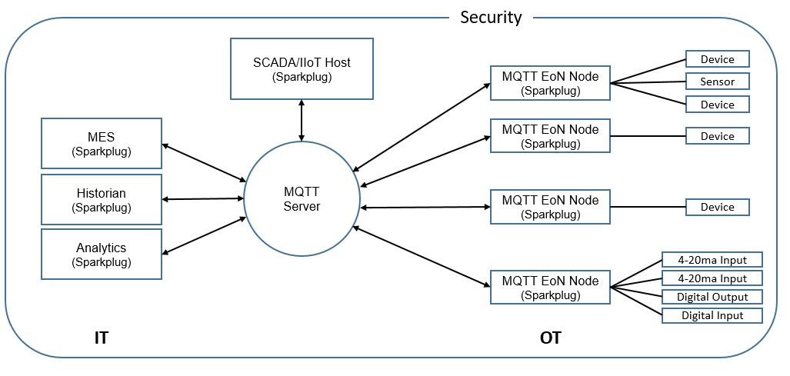
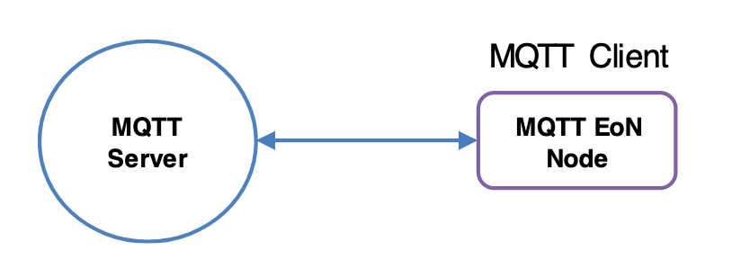
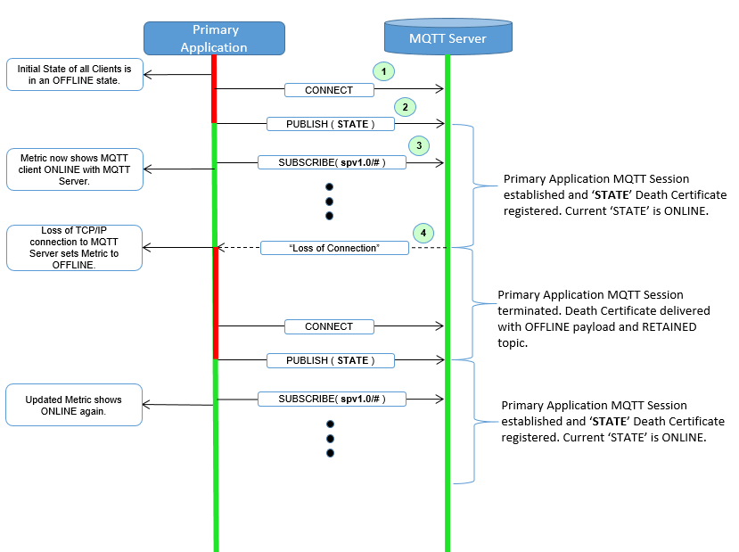
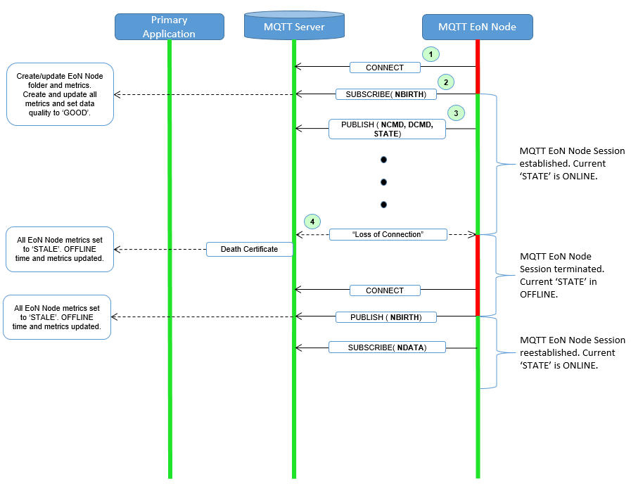
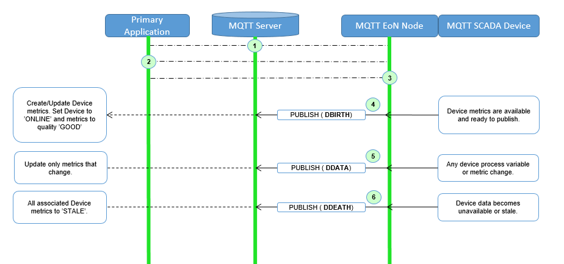
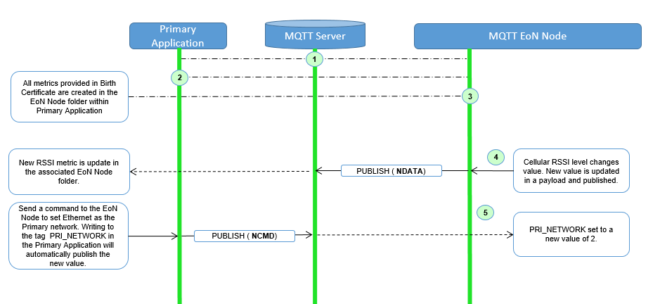
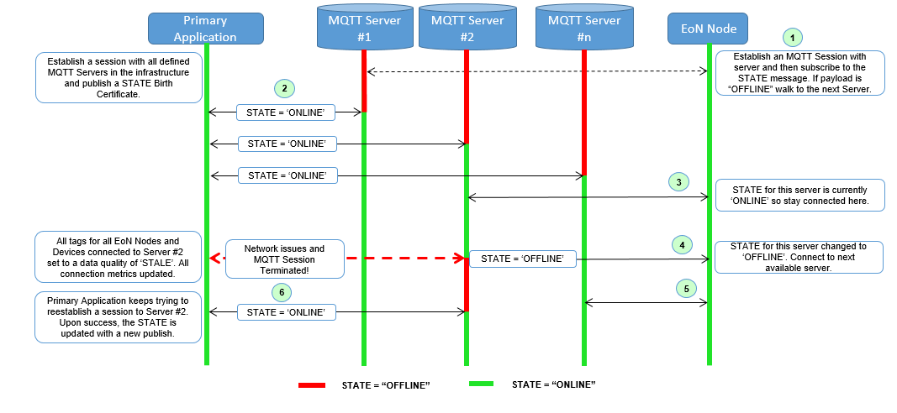
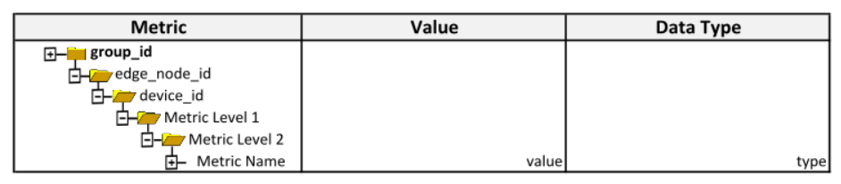
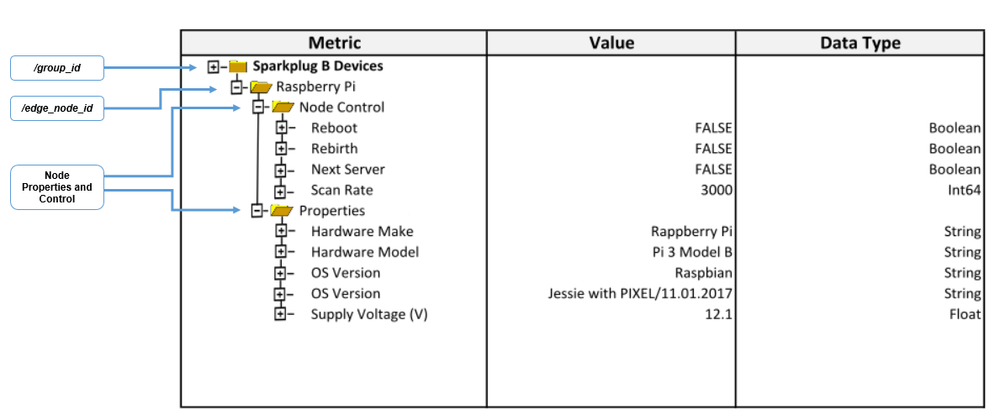
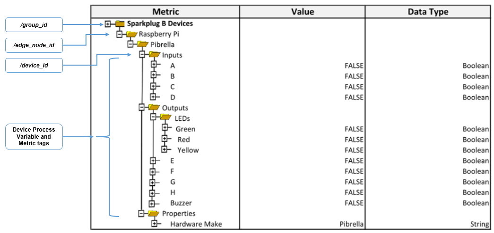

_Version 2.2_

Copyright © 2016-2020 Eclipse Foundation, Inc, Cirrus Link Solutions, and others

This program and the accompanying materials are made available under the
terms of the Eclipse Public License v. 2.0 which is available at
https://www.eclipse.org/legal/epl-2.0.
SPDX-License-Identifier: EPL-2.0

_Sparkplug™ and the Sparkplug™ logo are trademarks of the Eclipse Foundation_

[cols=",,,",options="header",]
|===
|*Revision Number* |*Date* |*Author* |*Description*
|1.0 |5/26/16 |Cirrus Link |Initial Release
|2.1 |12/10/16 |Cirrus Link |Payload B Addition
|2.2 |10/11/19 |Cirrus Link |Re-branding for Eclipse foundation added TM to Sparkplug
| | | |
| | | |
|===

== Table of Contents

Table of Figures 5

{empty}1. Introduction 6

1.1. Define an MQTT Topic Namespace 6

1.2. Define MQTT State Management 6

1.3. Define the MQTT Payload 6

{empty}2. Background 7

{empty}3. Infrastructure Components 8

3.1. MQTT Server(s) 8

3.2. MQTT Edge of Network (EoN) Node 8

3.3. Device/Sensor 8

3.4. MQTT Enabled Device(Sparkplug™) 8

3.5. SCADA/IIoT Host 9

3.6. MQTT Application Node 9

3.7. Security 9

3.7.1. Authentication 9

3.7.2. Authorization 9

3.7.3. Encryption 9

{empty}4. Leveraging Standards and Open Source 10

4.1. OASIS MQTT V3.1.1 Specification 10

4.2. Eclipse Foundation IoT Resources 10

4.2.1. Paho 10

4.3. Google Protocol Buffers 10

4.3.1. Kura Google Protocol Buffer Schema 10

4.4. Raspberry Pi Hardware 10

{empty}5. General Message Flow 11

5.1. MQTT Session State Awareness 11

{empty}6. Sparkplug™ MQTT Topic Namespace 12

6.1. Sparkplug™ Topic Namespace Elements 12

6.1.1. namespace Element 12

6.1.2. group_id Element 12

6.1.3. message_type Element 13

6.1.4. edge_node_id Element 13

6.1.5. device_id Element 13

{empty}7. Sparkplug™ MQTT Message Types 14

7.1. MQTT EoN Birth and Death Certificate 14

7.1.1. EoN Death Certificate (NDEATH) 15

7.1.2. EoN Birth Certificate (NBIRTH) 15

7.2. MQTT EoN node Data (NDATA) 15

7.3. MQTT Device Birth and Death Certificate 15

7.3.1. MQTT Device Birth Certificate (DBIRTH) 16

7.3.2. MQTT Device Death Certificate (DDEATH) 16

7.4. MQTT Device Data Messages (DDATA) 16

7.5. SCADA/IIoT Host Birth and Death Certificates 16

7.5.1. SCADA/IIoT Host Death Certificate Payload (STATE) 17

7.5.1. SCADA/IIoT Birth Certificate Payload (STATE) 17

7.6. EoN node Command (NCMD) 17

7.7. Device Command (DCMD) 18

{empty}8. Sparkplug™ MQTT Session Management and Message Flow 19

8.1. Primary Application Session Establishment 20

8.2. EoN node Session Establishment 22

8.3. MQTT Device Session Establishment 24

8.4. General MQTT applications and non-primary Applications. 26

{empty}9. Sparkplug™ MQTT Data and Command Messages 27

9.1. EoN NDATA and NCMD Messages 28

{empty}10. Primary Application STATE in Multiple MQTT Server Topologies 30

{empty}11. Sparkplug™ Persistent versus Non-Persistent Connections 32

{empty}12. Contact Information 33

Appendix 1 Sparkplug™ B Payload Definition 34

== Table of Figures

Figure 1 - MQTT SCADA Infrastructure 8

Figure 2 - Simple MQTT Infrastructure 11

Figure 3 - Host Session Establishment 20

Figure 4 - EoN node MQTT Session Establishment 22

Figure 5 - MQTT Device Session Establishment 24

Figure 6 - EoN node NDATA and NCMD Message Flow 29

Figure 7 – Primary Application STATE flow diagram 30

== Introduction

Sparkplug™ provides an open and freely available specification for how Edge of Network (EoN) gateways or native MQTT enabled end devices and MQTT Applications communicate bi-directionally within an MQTT Infrastructure. This document details the structure and implementation requirements for Sparkplug™ compliant MQTT Client implementations on both devices and applications.

It is recognized that MQTT is used across a wide spectrum of application solution use cases, and an almost indefinable variation of network topologies. To that end the Sparkplug™ specification strives to accomplish the three following goals.

=== Define an MQTT Topic Namespace

As noted many times in this document one of the many attractive features of MQTT is that is does not specify any required Topic Namespace within its implementation. This fact has meant that MQTT has taken a dominant position across a wide spectrum of IoT solutions. The intent of the Sparkplug™ specification is to identify and document a Topic Namespace that is well thought out and optimized for the SCADA/IIoT solution sector.

=== Define MQTT State Management

One of the unique aspects of MQTT is that it was originally designed for real time SCADA systems to help reduce data latency over bandwidth limited and often unreliable network infrastructure. In many implementations though the full benefit of this “Continuous Session Awareness” is not well understood, or not even implemented. The intent of the Sparkplug™ specification is to take full advantage of MQTT’s native Continuous Session Awareness capability as it applies to real time SCADA/IIoT solutions.

=== Define the MQTT Payload

Just as the MQTT specification does not dictate any particular Topic Namespace, nor does it dictate any particular payload data encoding. The intent of the Sparkplug™ specification is to strive to define payload encoding architectures that remain true to the original, lightweight, bandwidth efficient, low latency features of MQTT while adding modern encoding schemes targeting the SCADA/IIoT solution space.

Sparkplug™ has defined an approach where the Topic Namespace can aid in the determination of the encoding scheme of any particular payload. Currently there are two (2) Sparkplug™ defined encoding schemes that this specification supports. The first one is the Sparkplug™ A encoding scheme based on the very popular Kura open source Google Protocol Buffer definition. The second one is the Sparkplug™ B encoding scheme that provides a richer data model developed with the feedback of many system integrators and end user customers using MQTT.

== Background

MQTT was originally designed as a message transport for real-time SCADA systems. The MQTT message transport specification does *not* specify the Topic Namespace to use nor does it define the Payload representation of the data being published and/or subscribed to. In addition to this, since the original use case for MQTT was targeting real-time SCADA, there are mechanisms defined to provide the *state* of an MQTT session such that SCADA/Control HMI application can monitor the current state of any MQTT device in the infrastructure. As with the Topic Namespace and Payload the way state information is implemented and managed within the MQTT infrastructure is not defined. All of this was intentional within the original specification to provide maximum flexibility across any solution sector that might choose to use MQTT infrastructures.

But at some point, for MQTT based solutions to be interoperable within a given market sector, the Topic Namespace, Payload representation and session state must be defined. The intent and purpose of the Sparkplug™ specification is to define an MQTT Topic Namespace, payload, and session state management that can be applied generically to the overall IIoT market sector, but specifically meets the requirements of real-time SCADA/Control HMI solutions. Meeting the operational requirements for these systems will enable MQTT based infrastructures to provide more valuable real-time information to Line of Business and MES solution requirements as well.

The purpose of the Sparkplug™ specification is to remain true to the original notion of keeping the Topic Namespace and message sizes to a minimum while still making the overall message transactions and session state management between MQTT devices and MQTT SCADA/IIoT applications simple, efficient and easy to understand and implement.

== Infrastructure Components

This section details the infrastructure components implemented.

Figure 1 - MQTT SCADA Infrastructure

=== MQTT Server(s)

MQTT enabled infrastructure requires that one or more MQTT Servers are present in the infrastructure. The only requirement that the Sparkplug™ specification places on the selection of an MQTT Server component in the architecture is it is required to be compliant with the latest MQTT V3.1.1 specification and is sized to properly manage all MQTT message traffic.

One can implement the use (if required) of multiple MQTT servers for redundancy, high availability, and scalability within any given infrastructure.

=== MQTT Edge of Network (EoN) Node

In the context of this specification, an MQTT Edge of Network (EoN) Node is any V3.1.1 compliant MQTT Client application that manages an MQTT Session and provides the physical and/or logical gateway functions required to participate in the Topic Namespace and Payload definitions described in this document. The EoN node is responsible for any local protocol interface to existing legacy devices (PLCs, RTUs, Flow Computers, Sensors, etc.) and/or any local discrete I/O, and/or any logical internal process variables(PVs).

=== Device/Sensor 

The Device/Sensor represents any physical or logical device connected to the MQTT EoN node providing any data, process variables or metrics.

=== MQTT Enabled Device(Sparkplug™)

This represents any device, sensor, or hardware that directly connects to MQTT infrastructure using a compliant MQTT 3.1.1 connection with the payload and topic notation as outlined in this Sparkplug™ specification. Note that it will be represented as an EoN node in the Sparkplug™ topic payload.

=== SCADA/IIoT Host

The SCADA/IIoT Host Node is any MQTT Client application that subscribes to and publishes messages defined in this document. In typical SCADA/IIoT infrastructure implementations, there will be only one *Primary* SCADA/IIoT Host Node responsible for the monitoring and control of a given group of MQTT EoN nodes. Sparkplug™ does support the notion of multiple critical Host applications. This does not preclude any number of additional MQTT SCADA/IIoT Nodes participating in the infrastructure that are in either a pure monitoring mode, or in the role of a hot standby should the Primary MQTT SCADA/IIoT Host go offline.

=== MQTT Application Node 

An MQTT Application Node is any non-primary MQTT SCADA/IIoT Client application that consumes the real-time messages or any other data being published with proper permission and security.

=== Security 

==== Authentication

There are several levels of security and access control configured within an MQTT infrastructure. From a pure MQTT client perspective, the client does need to provide a unique Client ID, and an optional Username and Password.

==== Authorization

Although access control is not mandated in the MQTT specification for use in MQTT Server implementations, Access Control List (ACL) functionality is available for most MQTT Server implementations. The ACL of an MQTT Server implementation is used to specify which Topic Namespace any MQTT Client can subscribe to and publish on. Examples are provided on how to setup and manage MQTT Client credentials and some considerations on setting up proper ACL’s on the MQTT Servers.

==== Encryption

The MQTT specification does not specify any TCP/IP security scheme as it was envisaged that TCP/IP security would (and did) change over time. Although this document will not specify any TCP/IP security schema it will provide examples on how to secure an MQTT infrastructure using TLS security.

== Leveraging Standards and Open Source

In addition to leveraging the latest MQTT V3.1.1 standards, the Sparkplug™ specification leverages as much open source development tooling and data encoding as possible.

=== OASIS MQTT V3.1.1 Specification

The Sparkplug™ specification specifies that MQTT Server/Clients in the infrastructure adhere to the MQTT V3.1.1 specification. The specification documentation refers to “*_mqtt-v3.1.1-os.doc_*”:

http://docs.oasis-open.org/mqtt/mqtt/v3.1.1/mqtt-v3.1.1.html

Also referred is an addendum document to the MQTT V3.1.1 specification document that discusses best practices for implementing security on MQTT TCP/IP networks:

http://docs.oasis-open.org/mqtt/mqtt-nist-cybersecurity/v1.0/mqtt-nist-cybersecurity-v1.0.doc

=== Eclipse Foundation IoT Resources

The Eclipse Foundation is an excellent resource for open source software supporting industry standards. Within the Eclipse Foundation is an Internet of Things (IoT) working group providing a wealth of information.

http://iot.eclipse.org/

==== Paho

Paho is an Eclipse Foundation project that offers excellent resources for mature, compliant MQTT Client and MQTT Server implementations and well as additional resources for all things MQTT.

http://www.eclipse.org/paho/

=== Google Protocol Buffers

Protocol buffers are Google's language-neutral, platform-neutral, extensible mechanism for serializing structured data. Google Protocol Buffers are used to encode the Sparkplug™ payload in both versions A and B of the Sparkplug™ payload specification.

https://developers.google.com/protocol-buffers/

==== Kura Google Protocol Buffer Schema

Kura is another Eclipse Foundation project under IoT resources. Kura provides open source resources for the Google Protocol Buffer representation of MQTT payloads as defined in the Sparkplug™ A payload definition:

https://github.com/eclipse/kura/blob/develop/kura/org.eclipse.kura.core.cloud/src/main/protobuf/kurapayload.proto

=== Raspberry Pi Hardware

For the sake of keeping the Sparkplug™ specification as real world as possible, a reference implementation of an EoN node and associated Device is provided for the examples and screen shots in this document. All of this was implemented on Raspberry Pi hardware representing the EoN node with a Pibrella I/O board representing the Device.

== General Message Flow

This section discusses the generic topology shown in Figure 3 – Simple MQTT Infrastructure identifying how each of the components of the infrastructure interacts.

At the simplest level, there are only two components required as shown below. An MQTT Client and an MQTT Server. With proper credentials, any MQTT Client can connect to the MQTT Server without any notion of other MQTT Client applications that are connected, and can issue subscriptions to any MQTT messages that it might be interested in as well as start publishing any message containing data that it has. This is one of the principal notions of IIoT, that is the decoupling of intelligent devices from any direct connection to any one consumer application.

Figure 2 - Simple MQTT Infrastructure

=== MQTT Session State Awareness

In any network architecture, network connection *_State_* is important. In SCADA/IIoT, connection *_State_* is extremely important. *State* is the session awareness of the MQTT EoN and the MQTT Server. The very reason that most SCADA Host systems in this market sector are still using legacy poll/response protocols to maintain a notion of the *_State_* of the connection between the SCADA application and the connected devices. “_I poll, I get a response, I know the *State* of all the I/O points, but now I must poll again because that *State* may have changed.”_

Many implementations of solutions using MQTT treat it as a simple, stateless, pub/sub state machine. This is quite viable for IoT and some IIoT applications, however it is not taking advantage of the full capability of MQTT based infrastructures.

One of the primary applications for MQTT as it was originally designed was to provide reliable SCADA communications over VSAT topologies. Due to propagation delay and cost, it was not feasible to use a poll/response protocol. Instead of a poll/response protocol where all the data was sent in response to every poll, MQTT was used to “publish” information from remote sites only when the data changed. This technique is sometimes called Report by Exception or RBE. But for RBE to work properly in real-time SCADA, the “state” of the end device needs to be always known. In other words, SCADA/IIoT host could only rely on RBE data arriving reliably if it could be assured of the state of the MQTT session.

The Sparkplug™ specification defines the use of the MQTT V3.1.1 “Last Will and Testament” feature to provide MQTT session state information to any other interested MQTT client in the infrastructure. The session state awareness is implemented around a set of defined “Birth” and “Death” Topic Namespace and Payload definitions in conjunction with the MQTT connection “Keep Alive” timer.

== Sparkplug™ MQTT Session Management and Message Flow

An MQTT based SCADA system is unique in that the Host node is NOT responsible for establishing and maintaining connections to the devices as is the case in most existing legacy poll/response device protocols. With an MQTT based architecture, both the Host application as well as the devices establish MQTT Sessions with a central MQTT Server(s). This is the desired functionality as it provides the necessary decoupling from any one application and any given device. Additional MQTT clients can connect and subscribe to any of the real time data without impacting the primary SCADA Host application(s).

Due to the nature of real time SCADA solutions, it is very important for the primary SCADA Host and all connected MQTT EoN nodes to have the MQTT Session STATE information for each other. In order to accomplish this the Sparkplug™ Topic Namespace definitions for Birth/Death certificates along with the defined payloads provide both state and context between the SCADA Host MQTT client and the associated node side MQTT Clients. In most use cases and solution scenarios there are two primary reasons for this “designation” of a primary SCADA Host:

[arabic]
. Only the Host _Primary_ _Application(s)_ should have the permission to issue commands to end devices.
. In high availability and redundancy use cases where multiple MQTT Servers are used, MQTT EoN nodes need to be aware of whether _Primary Application_ has network connectivity to each MQTT Server in the infrastructure. If the _Primary Application_ STATE shows that an EoN node is connected to an MQTT Server that the _Primary Application_ is *NOT* connected to, then the EoN node should walk to the next available MQTT Server where STATE for the _Primary Application_ is ‘ONLINE’.

=== Primary Application Session Establishment 

The _Primary Application_ upon startup or reconnect will immediately try to create a Host MQTT Session with the configured _MQTT Server infrastructure_. Note that the establishment of an MQTT Host session is asynchronous of any other MQTT Client session. If EoN nodes are already connected to the _MQTT Server infrastructure_, the _Primary Application_ will synchronize with them. If associated EoN nodes are not connected, _Primary Application_ will register them when they publish their Birth Certificate.

Figure 3 - Host Session Establishment

The session diagram in Figure 3 - Host Session Establishment shows a very simple topology with a single MQTT Server. The steps outlined in the session diagram are defined as follows:

[arabic]
. _Primary Application_ will try to create an MQTT Session using the MQTT CONNECT Control Packet (_refer to section 3.1 in the MQTT V3.1.1 specification_). A Death Certificate is constructed into the Will Topic and Will Payload of the of the Connect Control Packet with a Will QoS = 1 and Will Retain = true. The MQTT CONNECT Control Packet is acknowledged as successful with a valid CONNACK Control Packet. From this point forward in time, the MQTT Server is ready to deliver a Host Death Certificate any time the _Primary Application_ MQTT Client loses connectivity to the MQTT Server.
. Once an MQTT Session has been established, _Primary Application_ will publish a new STATE message as defined in in section 7.5.1, _SCADA/IIoT_ Birth Certificate Payload. At this point, _Primary Application_ can update the MQTT Client metrics in the _Primary Application_ with a current state of ONLINE.
. With the MQTT Session established, and a STATE Birth Certificate published, the _Primary Application_ will issue an MQTT subscription for the defined Sparkplug™ Topic Namespace. The _Primary Application_ is now ready to start receiving MQTT messages from any connected EoN node within the infrastructure. Since the _Primary Application_ is also relying on the MQTT Session to the MQTT Server(s), the availability of Servers to the _Primary Application_ is also being monitored and reflected in the MQTT Client metrics in the _Primary Application_.
. If at any point in time _Primary Application_ loses connectivity with the defined MQTT Server(s), the ONLINE state of the Server is immediately reflected in the MQTT Client metrics in the _Primary Application_. All metric data associated with any MQTT EoN node that was connected to that MQTT Server will be updated to a “*STALE*” data quality.

=== EoN node Session Establishment 

Any EoN node in the MQTT infrastructure must establish an MQTT Session prior to providing information for connected devices. Most implementations of an MQTT EoN node for real time SCADA will try to maintain a persistent MQTT Session with the _MQTT Server infrastructure_. But there are use cases where the MQTT Session does not need to be persistent. In either case, an EoN node can try to establish an MQTT session at any time and is completely asynchronous from any other MQTT Client in the infrastructure. The only exception to this rule is the use case where there are multiple MQTT Servers and a Primary Host application.

Figure 4 - EoN node MQTT Session Establishment

The session diagram in Figure 4 - EoN node MQTT Session Establishment shows a very simple topology with a single MQTT Server. The steps outlined in the session diagram are defined as follows:

[arabic]
. The EoN node MQTT client will attempt to create an MQTT session to the available MQTT Server(s) using the MQTT CONNECT Control Packet (_refer to section 3.1 in the MQTT V3.1.1 specification_). The Death Certificate constructed into the Will Topic and Will Payload follows the format defined in section 0,
. EoN Node Death Certificate (NDEATH). The MQTT CONNECT Control Packet is acknowledged as successful with a valid CONNACK Control Packet. From this point forward in time, the MQTT Server is ready to deliver an EoN node Death Certificate to any subscribing MQTT Client any time connectivity is lost.
. The subscription to NCMD level topics ensures that EoN targeted messages from the _Primary Application_ are delivered. The subscription to DCMD ensures that device targeted messages from the _Primary Application_ are delivered. In applications with multiple MQTT Servers and designated Primary Host applications, the subscription to STATE informs the EoN node the current state of the Primary SCADA/IIoT Host. At this point the EoN node has fully completed the steps required for establishing a valid MQTT Session with the _Primary Application_.
. Once an MQTT Session has been established, the EoN node MQTT client will publish an application level NBIRTH as defined in section 7.1.2, EoN Node Birth Certificate (NBIRTH). At this point, the _Primary Application_ will have all the information required to build out the EoN node metric structure and show the EoN node in an “ONLINE” state.
. If at any point in time the EoN node MQTT Client loses connectivity to the defined MQTT Server(s), a Death Certificate is issue by the MQTT Server on behalf of the EoN node. Upon receipt of the Death Certificate, the _Primary Application_ will set the state of the EoN node to ‘OFFLINE’ and update all timestamp metrics concerning the connection. Any defined metrics will be set to a “*STALE*” data quality.

=== MQTT Device Session Establishment

The Sparkplug™ specification is provided to get real time process variable information from existing and new end devices measuring, monitoring and controlling a physical process into an MQTT MOM infrastructure and the _Primary Application_ Industrial Internet of Things application platform. In the context of this document an MQTT Device can represent anything from existing legacy poll/response driven PLCs, RTUs, HART Smart Transmitter, etc., to new generation automation and instrumentation devices that can implement a conformant MQTT client natively.

The preceding sections in this document detail how the _Primary Application_ interacts with the _MQTT Server infrastructure_ and how that infrastructure interacts with the notion of an MQTT EoN node. But to a large extent the technical requirements of those pieces of the infrastructure have already been provided. For most use cases in this market sector the primary focus will be on the implementation of the Sparkplug™ specification between the native device and the EoN node API’s.

In order to expose and populate the metrics from any intelligent device, the following simple session diagram outlines the requirements:

Figure 5 - MQTT Device Session Establishment

The session diagram in Figure 5 - MQTT Device Session Establishment shows a simple topology with all the Sparkplug™ elements in place i.e. _Primary Application_, MQTT Server(s), MQTT EoN node and this element, the device element. The steps outlined in the session diagram are defined as follows:

This flow diagram assumes that at least one MQTT Server is available and operational within the infrastructure. Without at least a single MQTT Server the remainder of the infrastructure is unavailable.

[arabic]
. Assuming MQTT Server is available.
. Assuming the _Primary Application_ established MQTT Session with the MQTT Server(s).
. The Session Establishment of the associated MQTT EoN node is described in section 8.2, EoN node Session Establishment. This flow diagram assumes that the EoN node session has already been established with the _Primary Application_. Depending on the target platform, the EoN node may be a physical “Edge of Network” gateway device polling physical legacy devices via Modbus, AB, DNP3.0, HART, etc., a MQTT enabled sensor or device, or it might be a logical implementation of one of the Eclipse Tahu reference implementations for prototype EoN nodes running on the Raspberry PI platform. Regardless of the implementation, at some point the device interface will need to provide a state and associated metrics to publish to the MQTT infrastructure.
. State #4 in the session diagram represents the state at which the device is ready to report all of its metric information to the MQTT EoN node as defined in Sparkplug™. It is the responsibility of the EoN node (logical or physical) to put this information in a form defined in 0,
. {blank}
. Device Birth Certificate (DBIRTH). Upon receiving the DBIRTH message, the _Primary Application_ can build out the proper metric structure.
. Following the Sparkplug™ specification in section 7.4, Device Data Messages (DDATA), all subsequent metrics are published to the _Primary Application_ on a Report by Exception (RBE) basis using the DDATA message format.
. In at any time the device (logical or physical) cannot provide real time information, the MQTT EoN node specification requires that an DDEATH be published. This will inform the _Primary Application_ that all metric information be set to a “*STALE*” data quality.

=== General MQTT applications and non-primary Applications.

As noted above, there is the notion of a _Primary Application_ instance in the infrastructure that has the required permissions to send command to nodes and devices and the fact that all EoN nodes need to know the _Primary Application_ is connected to the same MQTT Server its connected to or it needs to walk to another one in the infrastructure. Both are known requirements of a mission critical SCADA system.

But unlike legacy SCADA system implementations, all real time process variable information being published thru the MQTT infrastructure is available to any number of additional MQTT Clients in the business that might be interested in subsets if not all of the real time data.

The *ONLY* difference between a _Primary Application_ MQTT client and all other clients that _non-primary_ Client do *NOT* issue the STATE Birth/Death certificates.

== Sparkplug™ MQTT Data and Command Messages

Looking back in this document we’ve described the following components:

* Primary Application
* MQTT Server(s)
* Edge of Network (EoN) nodes
* Devices
* Topic Namespace
* Birth Certificates
* Death Certificates
* STATE Messages
* Primary Application, EoN node, and Device Session Establishment

All of these specifications and definitions get to the primary goal of Sparkplug™, that is to deliver a rich set of real time device metric data extremely efficiently to many data consumers within the Enterprise while still providing a best in class Command/Control SCADA/IIoT system.

The disruptive notion of the emerging IIoT mindset is that intelligent devices should be smart enough to deliver metric information to the infrastructure when it is required. But the fact of the matter is that the existing population of 100’s of millions of the smart devices need to be “asked” if something has changed using poll/response protocols. This is why we’re seeing the emergence of edge devices throughout the industrial sector. For the decade or more that it will take for device manufactures to embed IIoT technology natively, the solution being employed today is to place this capability in small embedded devices closer to the data producers themselves. So within the Sparkplug™ specification these devices called Edge of Network Nodes (EoN) represent this new class of Gateway, Edge Controller, Edge of Network Node, Protocol Gateway, and many more acronyms for the same class of devices. The capabilities of these devices are in an extreme range of low power microcontrollers to multicore Intel and ARM based processors. The operating systems range from full embedded Linux kernels and Windows embedded to small bare metal RTOS’s. Regardless of the category these gateway devices fall into the simplicity of MQTT and the Sparkplug™ specification should be applicable across the board.

This section of the Sparkplug™ specification goes into detail on how metrics are published/subscribed to within an MQTT infrastructure in real time and the resulting metric information that the _Primary Application_ can read/write to.

=== EoN NDATA and NCMD Messages

We’ll start this section with a description of how metric information is published to the _Primary Application_ from an EoN node in the MQTT infrastructure. The definition of an EoN node is generic in that it can represent both physical “Edge of Network Gateway” devices that are interfacing with existing legacy equipment and a logical MQTT endpoint for devices that natively implement the Sparkplug™ specification. Section 7.4.1 above defines the Birth Certificate MQTT Payload and the fact that it can provide any number of metrics that will be exposed in the _Primary Application_. Some of these will be “read only” such as:

* EoN Manufacture ID
* EoN Device Type
* EoN Serial Number
* EoN Software Version Number
* EoN Configuration Change Count
* EoN Position (if GPS device is available)
* EoN Cellular RSSI value (if cellular is being used)
* EoN Power Supply voltage level
* EoN Temperature

Other metrics may be dynamic and “read/write” such as:

* EoN Rebirth command to republish all EoN and Device Birth Certificates.
* EoN Next server command to move to next available MQTT Server.
* EoN Reboot command to reboot the EoN node.
* EoN Primary Network (PRI_NETWORK) where 1 = Cellular, 2 = Ethernet

The important point to realize is that the metrics exposed in the _Primary Application_ for use in the design of applications are completely determined by what metric information is published in the NBIRTH. Each specific EoN node can best determine what data to expose, and how to expose it, and it will automatically appear in the _Primary Application_ metric structure. Metrics can even be added dynamically at runtime and with a new NBIRTH. These metrics will automatically be added to the _Primary Application_ metric structure.

The other very important distinction to make here is that EoN node NDATA and NCMD messages are decoupled from the device level data and command messages of DDATA and DCMD. This decoupling in the Topic Namespace is important because it allows interaction from all MQTT Clients in the system (to the level of permission and application) with the EoN nodes, but NOT to the level of sending device commands. The _Primary Application_ could provide a configuration parameter that would BLOCK output DDATA and DCMD messages but still allow NDATA and NCMD messages to flow. In this manner, multiple application systems can be connected to the same MQTT infrastructure, but only the ones with DCMD enabled can publish Device commands.

The following simple message flow diagram demonstrates the messages used to update a changing cellular RSSI value in the _Primary Application_ and sending a command from the _Primary Application_ to the EoN node to use a different primary network path.

Figure 6 - EoN node NDATA and NCMD Message Flow

[arabic]
. Assuming MQTT Server is available.
. Assuming the _Primary Application_ established MQTT Session with the MQTT Server(s).
. The EoN node has an established MQTT Session and the NBIRTH has been published. _Primary Application_ now has all defined metrics and their current value.
. The EoN node is monitoring its local cellular RSSI level. The level has changed and now the EoN node wants to publish the new value to the associated metric in _Primary Application_.
. From an operational requirement, the EoN node needs to be told to switch its primary network interface from cellular to Ethernet. From the _Primary Application,_ the new value is written to the metric and will automatically publish the new value to the EoN node parameters.

== Primary Application STATE in Multiple MQTT Server Topologies

For implementations with multiple MQTT Servers, there is one additional aspect that needs to be understood and managed properly. When multiple MQTT Servers are available there is the possibility of “stranding” and EoN node if the Primary command/control of the _Primary Application_ loses network connectivity to one of the MQTT Servers. In this instance the EoN node would stay properly connected to the MQTT Server publishing information not knowing that _Primary Application_ was not able to receive the messages. When using multiple MQTT Servers, the _Primary Application_ instance must be configured to publish a STATE Birth Certificate and all EoN nodes need to subscribe to this STATE message.

The _Primary Application_ will need to specify whether it is a “Primary” command/control instance or not. If it is a primary instance then every time it establishes a new MQTT Session with an MQTT Server, the STATE Birth Certificate defined in section above is the first message that is published after a successful MQTT Session is established.

EoN node devices in an infrastructure that provides multiple MQTT Servers can establish a session to any one of the MQTT Servers. Upon establishing a session, the EoN node should issue a subscription to the STATE message published by _Primary Application_. Since the STATE message is published with the RETAIN message flag set, MQTT will guarantee that the last STATE message is always available. The EoN node should examine the payload of this message to ensure that it is a value of “ONLINE”. If the value is “OFFLINE”, this indicates the Primary Application has lost its MQTT Session to this particular MQTT Server. This should cause the EoN node to terminate its session with this MQTT Server and move to the next available MQTT Server that is available. This use of the STATE message in this manner ensures that any loss of connectivity to an MQTT Server to the _Primary Application_ does not result in EoN nodes being “stranded” on an MQTT server because of network issues. The following message flow diagram outlines how the STATE message is used when three (3) MQTT Servers are available in the infrastructure:

Figure 7 – Primary Application STATE flow diagram

[arabic]
. When an EoN node is configured with multiple available MQTT Servers in the infrastructure it should issue a subscription to the _Primary Application_ STATE message. The EoN nodes are free to establish an MQTT Session to any of the available servers over any available network at any time and examine the current STATE value. If the STATE message payload is ‘OFFLINE’ then the EoN node should disconnect and walk to the next available server.
. Upon startup, the configured Primary Application, the MQTT Session will be configured to register the _Primary Application_ DEATH Certificate that indicates STATE is ‘OFFLINE’ with the message RETAIN flag set to true. Then the _Primary Application_ BIRTH Certificate will be published with a STATE payload of ‘ONLINE’.
. As the EoN node walks its available MQTT Server table, it will establish an MQTT Session with a server that has a STATE message with a payload of ‘ONLINE’. The EoN node can stay connected to this server if its MQTT Session stays intact and it does not receive the _Primary Application_ DEATH Certificate.
. Having a subscription registered to the MQTT Server on the STATE topic will result in any change to the current the _Primary Application_ STATE being received immediately. In this case, a network disruption causes the _Primary Application_ MQTT Session to server #2 to be terminated. This will cause the MQTT Server, on behalf of the now terminated the _Primary Application_ MQTT Client to publish the DEATH certificate to anyone that is currently subscribed to it. Upon receipt of the _Primary Application_ DEATH Certificate this EoN node will move to the next MQTT Server in its table.
. The EoN node moved to the next available MQTT Server and since the current STATE on this server is ‘ONLINE’, it can stay connected.
. In the meantime, the network disruption between _Primary Application_ and MQTT Server #2 has been corrected. The _Primary Application_ has a new MQTT Session established to server #2 with an update Birth Certificate of ‘ONLINE’. Now MQTT Server #2 is ready to accept new EoN node session requests.

== Sparkplug™ Persistent versus Non-Persistent Connections

Persistent connections are intended to remain connected to the MQTT infrastructure at all times. They never send an MQTT DISCONNECT message during normal operation. This fact lets the _Primary Application_ provide the real-time state of every persistent node in the infrastructure within the configured MQTT Keep Alive period using the Birth/Death mechanisms defined above.

But in some use cases, such as sending GPS coordinates for asset tracking or other IOT applications with periodic data from sensors, MQTT enabled devices do not need to remain connected to the MQTT infrastructure. In these use cases, all the Device needs to do is to issue an MQTT DISCONNECT control packet prior to going offline to leave the MQTT infrastructure “gracefully”. In this case an MQTT Device or associated Device DEATH certificate will most normally not be seen. System designers just need to be aware that the metric in _Primary Application_ in this case will represent “Last Known Good” values with a time stamp of this data where the current state of the of the MQTT Device is not a real-time indication. The _Primary Application_ metric time stamp values can be used to determine when the values from this node were last updated.

Non-persistent MQTT Enabled Devices should still register a proper DEATH Certificate upon the establishment of an MQTT session. In this manner, the _Primary Application_ can still have a good representation of Last Known Good process variable versus the fact that the MQTT session was terminated prior to the EoN node being able to complete its transaction.

== Contact Information 

The Eclipse Foundation appreciates any and all feedback on this specification. It is only from the feedback of end users that Sparkplug™ can a viable and vibrant reference implementation for MQTT based SCADA and IIoT solutions.

For any questions regarding this Sparkplug™ specification or for more information, please use the following details:

*Eclipse Foundation*

Website: http://www.eclipse.org[www.eclipse.org]

Phone: +1.613.224.9461

[arabic]
. Sparkplug™ B Payload Definition

Sparkplug™ Specification

Sparkplug™ B Payload Definition

Version v1.0

** +
**

[cols=",,,",options="header",]
|===
|*Revision Number* |*Date* |*Author* |*Description*
|1.0 |1/16/2017 |Cirrus Link |Initial Release
| | | |
| | | |
|===

== Table of Contents

Table of Figures 39

{empty}13. Introduction 40

{empty}14. Sparkplug™ B MQTT Payload Definition 40

14.1. Google Protocol Buffers 41

14.2. Sparkplug™ B Google Protocol Buffer Schema 41

14.3. Payload Metric Naming Convention 44

{empty}15. Sparkplug™ Bv1.0 Payload Components 46

15.1. Payload Component Definitions 46

15.1.1. Payload 46

15.1.2. Metric 46

15.1.3. MetaData 48

15.1.4. PropertySet 48

15.1.5. PropertyValue 49

15.1.6. PropertySetList 49

15.1.7. DataSet 49

15.1.8. DataSet.Row 50

15.1.9. DataSet.DataSetValue 50

15.1.10. Template 50

15.1.11. Template.Parameter 51

15.2. Sparkplug™ Bv1.0 Payload Datatypes 51

15.2.1. Metric Datatypes 51

15.2.2. PropertyValue Datatypes 53

15.2.3. DataSetValue DataTypes 55

15.2.4. Template.Parameter DataTypes 56

{empty}16. Payloads by Message Type 58

16.1. NBIRTH 58

16.2. DBIRTH 59

16.3. NDATA 59

16.4. DDATA 59

16.5. NCMD 60

16.6. DCMD 60

16.7. DDEATH 60

16.8. NDEATH 60

16.9. STATE 60

{empty}17. Payload Representation on Backend Applications 61

17.1. NBIRTH 61

17.2. DBIRTH 62

17.3. NDATA 64

17.4. DDATA 65

17.5. NCMD 66

17.6. DCMD 66

17.7. NDEATH 67

17.8. DDEATH 67

17.9. STATE 68

== Table of Figures

Figure 1 – Payload Metric Folder Structure 45

Figure 2 – Sparkplug™ B Metric Structure 1 62

Figure 3 – Sparkplug™ B Metric Structure 2 64

== Introduction

The MQTT message transport specification does not define any required data payload format. From an MQTT infrastructure standpoint, the payload is treated as an agnostic binary array of bytes that can be anything from no payload at all, to a maximum of 256MB. But for applications within a known solution space to work using MQTT the payload representation does need to be defined.

This section of the Sparkplug™ specification defines how an MQTT Sparkplug™ B payload is encoded and the data that is required. Note that Sparkplug™ supports multiple payloads encoding definitions. For more detailed information on the payload formats and encoding associated with each Sparkplug™ release see the appendices.

The majority of devices connecting into next generation IIoT infrastructure are legacy equipment using poll/response protocols. This means we must take in account register based data from devices that talk protocols like Modbus. The existing legacy equipment needs to work in concert with emerging IIoT equipment that is able to leverage message transports like MQTT natively.

== Sparkplug™ B MQTT Payload Definition

The goal of the Sparkplug™ is to provide a specification that both OEM device manufactures and application developers can use to create rich and interoperable SCADA/IIoT solutions using MQTT as a base messaging technology. In Sparkplug™ B message payload definition, the goal was to create a simple and straightforward binary message encoding that could be used primarily for legacy register based process variables (Modbus register value for example).

The Sparkplug™ B MQTT payload specification has come about based on the feedback from many system integrators and end user customers who wanted to be able to natively support a much richer data model within the MQTT infrastructures that they were designing and deploying. Using the feedback from the user community Sparkplug™ B provides support for:

* Complex data types using templates.
* Datasets.
* Richer metrics with the ability to add property metadata for each metric.
* Metric alias support to maintain rich metric naming while keeping bandwidth usage to a minimum.
* Historical data.
* File data.

Sparkplug™ B definition creates a bandwidth efficient data transport for real time device data. For WAN based SCADA/IIoT infrastructures this equates to lower latency data updates while minimizing the amount of traffic and therefore cellular and/or VSAT bandwidth required. In situations where bandwidth savings is not the primary concern, the efficient use enables higher throughput of more and interesting data eliminating sensor data that have been left stranded in the field. It is also ideal for LAN based SCADA infrastructures equating to higher throughput of real time data to consumer applications without requiring extreme networking topologies and/or equipment.

There are many data encoding technologies available that can all be used in conjunction with MQTT. Sparkplug™ B selected an existing, open, and highly available encoding scheme that efficiently encodes register based process variables. The encoding technology selected for Sparkplug™ B is Google Protocol Buffers also referred to as *Google* *_Protobufs_*.

=== Google Protocol Buffers

*_“Protocol Buffers are a way of encoding structured data in an efficient yet extensible format.”_*

Google Protocol Buffers, sometimes referred to as “*Google Protobufs*”, provide the efficiency of packed binary data encoding while providing the structure required to make it easy to create, transmit, and parse register based process variables using a standard set of tools while enabling emerging IIoT requirements around richer metadata. Google Protocol Buffers development tools are available for:

* C
* C++
* C#
* Java
* Python
* GO
* JavaScript

Additional information on Google Protocol Buffers can be found at:

https://developers.google.com/protocol-buffers/

=== Sparkplug™ B Google Protocol Buffer Schema

Using lessons learned on the feedback from the Sparkplug™ A implementation a new Google Protocol Buffer schema was developed that could be used to represent and encode the more complex data models being requested. The entire Google Protocol Buffers definition is below.

syntax = "proto2";

//
// To compile:
// cd client_libraries/java
// protoc --proto_path=../../ --java_out=src/main/java ../../Sparkplug™_b.proto 
//

package org.eclipse.tahu.protobuf;

option java_package         = "org.eclipse.tahu.protobuf";

option java_outer_classname = "Sparkplug™BProto";

message Payload {

    /*

        // Indexes of Data Types

        // Unknown placeholder for future expansion.

        Unknown         = 0;

        // Basic Types

        Int8            = 1;

        Int16           = 2;

        Int32           = 3;

        Int64           = 4;

        UInt8           = 5;

        UInt16          = 6;

        UInt32          = 7;

        UInt64          = 8;

        Float           = 9;

        Double          = 10;

        Boolean         = 11;

        String          = 12;

        DateTime        = 13;

        Text            = 14;

        // Additional Metric Types

        UUID            = 15;

        DataSet         = 16;

        Bytes           = 17;

        File            = 18;

        Template        = 19;

        

        // Additional PropertyValue Types

        PropertySet     = 20;

        PropertySetList = 21;

    */

    message Template {

        message Parameter {

            optional string name        = 1;

            optional uint32 type        = 2;

            oneof value {

                uint32 int_value        = 3;

                uint64 long_value       = 4;

                float  float_value      = 5;

                double double_value     = 6;

                bool   boolean_value    = 7;

                string string_value     = 8;

                ParameterValueExtension extension_value = 9;

            }

            message ParameterValueExtension {

                extensions              1 to max;

            }

        }

        optional string version         = 1;          // The version of the Template to

// prevent mismatches

        repeated Metric metrics         = 2;          // Each metric is the name of the

// metric and the datatype of the

// member but does not contain a

// value

        repeated Parameter parameters   = 3;

        optional string template_ref    = 4;          // Reference to a template if this is

// extending a Template or an

// instance - must exist if an

// instance

        optional bool is_definition     = 5;

        extensions                      6 to max;

    }

    message DataSet {

        message DataSetValue {

            oneof value {

                uint32 int_value                        = 1;

                uint64 long_value                       = 2;

                float  float_value                      = 3;

                double double_value                     = 4;

                bool   boolean_value                    = 5;

                string string_value                     = 6;

                DataSetValueExtension extension_value   = 7;

            }

            message DataSetValueExtension {

                extensions  1 to max;

            }

        }

        message Row {

            repeated DataSetValue elements  = 1;

            extensions                      2 to max;   // For third party extensions

        }

        optional uint64   num_of_columns    = 1;

        repeated string   columns           = 2;

        repeated uint32   types             = 3;

        repeated Row      rows              = 4;

        extensions                          5 to max;   // For third party extensions

    }

    message PropertyValue {

        optional uint32     type                    = 1;

        optional bool       is_null                 = 2; 

        oneof value {

            uint32          int_value               = 3;

            uint64          long_value              = 4;

            float           float_value             = 5;

            double          double_value            = 6;

            bool            boolean_value           = 7;

            string          string_value            = 8;

            PropertySet     propertyset_value       = 9;

            PropertySetList propertysets_value      = 10;      // List of Property Values

            PropertyValueExtension extension_value  = 11;

        }

        message PropertyValueExtension {

            extensions                             1 to max;

        }

    }

    message PropertySet {

        repeated string        keys     = 1;         // Names of the properties

        repeated PropertyValue values   = 2;

        extensions                      3 to max;

    }

    message PropertySetList {

        repeated PropertySet propertyset = 1;

        extensions                       2 to max;

    }

    message MetaData {

        // Bytes specific metadata

        optional bool   is_multi_part   = 1;

        // General metadata

        optional string content_type    = 2;        // Content/Media type

        optional uint64 size            = 3;        // File size, String size, Multi-part

// size, etc.

        optional uint64 seq             = 4;        // Sequence number for multi-part

// messages

        // File metadata

        optional string file_name       = 5;        // File name

        optional string file_type       = 6;        // File type (i.e. xml, json, txt, cpp,

// etc.)

        optional string md5             = 7;        // md5 of data

        // Catchalls and future expansion

        optional string description     = 8;        // Could be anything such as json or

// xml of custom properties

        extensions                      9 to max;

    }

    message Metric {

        optional string   name          = 1;        // Metric name - should only be

// included on birth

        optional uint64   alias         = 2;        // Metric alias - tied to name on birth

// and included in all later DATA

// messages

        optional uint64   timestamp     = 3;        // Timestamp associated with data

// acquisition time

        optional uint32   datatype      = 4;        // DataType of the metric/tag value

        optional bool     is_historical = 5;        // If this is historical data and

// should not update real time tag

        optional bool     is_transient  = 6;        // Tells consuming clients such as MQTT

// Engine to not store this as a tag

        optional bool     is_null       = 7;        // If this is null - explicitly say so

// rather than using -1, false, etc. for

// some datatypes.

        optional MetaData metadata      = 8;        // Metadata for the payload

        optional PropertySet properties = 9;

        oneof value {

            uint32   int_value                      = 10;

            uint64   long_value                     = 11;

            float    float_value                    = 12;

            double   double_value                   = 13;

            bool     boolean_value                  = 14;

            string   string_value                   = 15;

            bytes    bytes_value                    = 16;       // Bytes, File

            DataSet  dataset_value                  = 17;

            Template template_value                 = 18;

            MetricValueExtension extension_value    = 19;

        }

        message MetricValueExtension {

            extensions  1 to max;

        }

    }

    optional uint64   timestamp     = 1;        // Timestamp at message sending time

    repeated Metric   metrics       = 2;        // Repeated forever - no limit in Google

// Protobufs

    optional uint64   seq           = 3;        // Sequence number

    optional string   uuid          = 4;        // UUID to track message type in terms of

// schema definitions

    optional bytes    body          = 5;        // To optionally bypass the whole

// definition above

    extensions                      6 to max;   // For third party extensions

}

=== Payload Metric Naming Convention

For the remainder of this document JSON will be used to represent components of a Sparkplug™ B payload. It is important to note that the payload is a binary encoding and is not actually JSON. However, JSON representation is used in this document to represent the payloads in a way that is easy to read. For example, a simple Sparkplug™ B payload with a single metric can be represented in JSON as follows:

{

        "timestamp": <timestamp>,

        "metrics": [{

                "name": <metric_name>,

                "alias": <alias>,

                "timestamp": <timestamp>,

                "dataType": <datatype>,

                "value": <value>

        }],

        "seq": <sequence_number>

}

A simple Sparkplug™ B payload with values would be represented as follows:

{

        "timestamp": 1486144502122,

        "metrics": [{

                "name": "My Metric",

                "alias": 1,

                "timestamp": 1479123452194,

                "dataType": "String",

                "value": "Test"

        }],

        "seq": 2

}

Note that the ‘name’ of a metric may be hierarchical to build out proper folder structures for applications consuming the metric values. For example, in an application where an EoN node in connected to several devices or data sources, the ‘name’ could represent discrete folder structures of:

‘Metric Level 1/Metric Level 2/Metric Name’

Using this convention in conjunction with the *group_id*, *edge_node_id* and *device_id* already defined in the Topic Namespace, consuming applications can organize metrics in the same hierarchical fashion:

Figure 8 – Payload Metric Folder Structure

== Sparkplug™ Bv1.0 Payload Components

The Sparkplug™ specification document “*_MQTT Topic Namespace and State Management_*” document defines the Topic Namespace that Sparkplug™ uses to publish and subscribe between EoN nodes and applications within the MQTT infrastructure. Using that Topic Namespace, this section of the specification defines the actual payload contents of each message type in Sparkplug™ Bv1.0.

=== Payload Component Definitions

Sparkplug™ B consists of a series of one or more metrics with metadata surrounding those metrics. The following definitions explain the components that make up a payload.

==== Payload

A Sparkplug™ B payload is the top-level component that is encoded and used in an MQTT message. It contains some basic information such as a timestamp and a sequence number as well as an array of metrics which contain key/value pairs of data. A Sparkplug™ B payload includes the following components.

* *payload*
** _timestamp_
*** This is the timestamp in the form of an unsigned 64-bit integer representing the number of milliseconds since epoch (Jan 1, 1970). It is highly recommended that this time is in UTC. This timestamp is meant to represent the time at which the message was published.
** _metrics_
*** This is an array of metrics representing key/value/datatype values. Metrics are further defined in section 3.1.2.
** _seq_
*** This is the sequence number which is an unsigned 64-bit integer. A sequence number must be included in the payload of every Sparkplug™ MQTT message. A NBIRTH message must always contain a sequence number of zero. All subsequent messages must contain a sequence number that is continually increasing by one in each message until a value of 255 is reached. At that point, the sequence number of the following message must be zero.
** _uuid_
*** This is a field which can be used to represent a schema or some other specific form of the message. Example usage would be to supply a UUID which represents an encoding mechanism of the optional array of bytes associated with a payload.
** _body_
*** This is an array of bytes which can be used for any custom binary encoded data.

==== Metric

A Sparkplug™ B metric is a core component of data in the payload. It represents a key/value/datatype along with metadata used to describe the information it contains. It includes the following components.

* *name*
** This is the friendly name of a metric. It should be represented as a slash delimited UTF-8 string. The slashes in the string represent folders of the metric to represent hierarchical data structures. For example, ‘outputs/A’ would be a metric with a unique identifier of ‘A’ in the ‘outputs’ folder. There is no limit to the number of folders. However, across the infrastructure of MQTT publishers a defined folder should always remain a folder.
* *alias*
** This is an unsigned 64-bit integer representing an optional alias for a Sparkplug™ B payload. If supplied in an NBIRTH or DBIRTH it must be a unique number across this EoN nodes entire set of metrics. In other words, no two metrics for the same EoN node can have the same alias. Upon being defined in the NBIRTH or DBIRTH, subsequent messages can supply only the alias instead of the metric friendly name to reduce overall message size.
* *timestamp*
** This is the timestamp in the form of an unsigned 64-bit integer representing the number of milliseconds since epoch (Jan 1, 1970). It is highly recommended that this time is in UTC. This timestamp is meant to represent the time at which the value of a metric was captured.
* *datatype*
** This is an unsigned 32-bit integer representing the datatype. Datatypes are not explicitly defined in the Sparkplug™ B Protobuf definition. Instead they are defined in section 4 of this document.
* *is_historical*
** This is a Boolean flag which denotes whether this metric represents a historical value. In some cases, it may be desirable to send metrics after they were acquired on a device or EoN node. This can be done for batching, store and forward, or sending local backup data during network communication loses. This flag denotes that the message should not be considered a real time/current value.
* *is_transient*
** This is a Boolean flag which denotes whether this metric should be considered transient. Transient metrics can be considered those that are of interest to a back-end application(s) but shouldn’t be stored in a historian on the backend.
* *is_null*
** This is a Boolean flag which denotes whether this metric has a null value. This is Sparkplug™ B’s mechanism of explicitly denoting a metric’s value is actually null.
* *metadata*
** This is a MetaData object associated with the metric for dealing with more complex datatypes. This is covered in section 3.1.3 of this document.
* *properties*
** This is a PropertySet object associated with the metric for including custom key/value pairs of metadata associated with a metric. This is covered in section 3.1.4 of this document.
* *value*
** The value of a metric utilizes the ‘oneof’ mechanism of Google Protocol Buffers. The value supplied with a metric must be one of the following types. Note if the metrics is_null flag is set to true the value can be omitted altogether.
*** _uint32_
**** Defined here: https://developers.google.com/protocol-buffers/docs/proto#scalar
*** _uint64_
**** Defined here: https://developers.google.com/protocol-buffers/docs/proto#scalar
*** _float_
**** Defined here: https://developers.google.com/protocol-buffers/docs/proto#scalar
*** _double_
**** Defined here: https://developers.google.com/protocol-buffers/docs/proto#scalar
*** _bool_
**** Defined here: https://developers.google.com/protocol-buffers/docs/proto#scalar
*** _string_
**** Defined here: https://developers.google.com/protocol-buffers/docs/proto#scalar
*** _bytes_
**** Defined here: https://developers.google.com/protocol-buffers/docs/proto#scalar
*** _DataSet_
**** Defined in section 3.1.7 of this document.
*** _Template_
**** Defined in section 3.1.10 of this document.

==== MetaData

A Sparkplug™ B MetaData object is used to describe different types of binary data. It includes the following components.

* *is_multi_part*
** A Boolean representing whether this metric contains part of a multi-part message. Breaking up large quantities of data can be useful for keeping the flow of MQTT messages flowing through the system. Because MQTT requires in order delivery publishing very large messages can result in messages being blocked while delivery of large messages takes place.
* *content_type*
** This is a UTF-8 string which represents the content type of a given metric value.
* *size*
** This is an unsigned 64-bit integer representing the size of the metric value
* *seq*
** If this is a multipart metric, this is an unsigned 64-bit integer representing the sequence number of this part of a multipart metric.
* *file_name*
** If this is a file metric, this is a UTF-8 string representing the filename of the file.
* *file_type*
** If this is a file metric, this is a UTF-8 string representing the type of the file.
* *md5*
** If this is a byte array metric that can have a md5sum, this field can be used as a UTF-8 string to represent it.
* *description*
** This is a freeform field with a UTF-8 string to represent any other pertinent metadata for this metric. It can contain JSON, XML, text, or anything else that can be understood by both the publisher and the subscriber.

==== PropertySet

A Sparkplug™ B PropertySet object is used with a metric to add custom properties to the object. The PropertySet is a map expressed as two arrays of equal size, one containing the keys and one containing the values. It includes the following components.

* *keys*
** This is an array of UTF-8 strings representing the names of the properties in this PropertySet. It must contain the same number of values included in the array of PropertyValue objects.
* *values*
** This is an array of PropertyValue objects representing the values of the properties in the PropertySet. It must contain the same number of items that are in the keys array.

==== PropertyValue

A Sparkplug™ B PropertyValue object is used to encode the value and datatype of the value of a property in a PropertySet. It includes the following components.

* *type*
** This is an unsigned 32-bit integer representing the datatype of the value. Datatypes are not explicitly defined in the Sparkplug™ B Protobuf definition. Instead they are defined in section 4 of this document.
* *is_null*
** This is a Boolean flag which denotes whether this property has a null value. This is Sparkplug™ B’s mechanism of explicitly denoting a property’s value is actually null.
* *value*
** The value of a property utilizes the ‘oneof’ mechanism of Google Protocol Buffers. The value supplied with a metric must be one of the following types. Note if the metrics is_null flag is set to true the value can be omitted altogether.
*** _uint32_
**** Defined here: https://developers.google.com/protocol-buffers/docs/proto#scalar
*** _uint64_
**** Defined here: https://developers.google.com/protocol-buffers/docs/proto#scalar
*** _float_
**** Defined here: https://developers.google.com/protocol-buffers/docs/proto#scalar
*** _double_
**** Defined here: https://developers.google.com/protocol-buffers/docs/proto#scalar
*** _bool_
**** Defined here: https://developers.google.com/protocol-buffers/docs/proto#scalar
*** _string_
**** Defined here: https://developers.google.com/protocol-buffers/docs/proto#scalar
*** _PropertySet_
**** Defined in section 3.1.4 of this document.
*** _PropertySetList_
**** Defined in section 3.1.6 of this document

==== PropertySetList

A Sparkplug™ B PropertySetList object is an array of PropertySet objects. It includes the following components.

* *propertyset*
** This is an array of PropertySet objects

==== DataSet

A Sparkplug™ B DataSet object is used to encode matrices of data. It includes the following components.

* *num_of_columns*
** This is an unsigned 64-bit integer representing the number of columns in this DataSet.
* *columns*
** This is an array of strings representing the column headers of this DataSet. It must have the same number of elements that the types array contains.
* *types*
** This is an array of unsigned 32 bit integers representing the datatypes of the columns. It must have the same number of elements that the columns array contains. Datatypes are not explicitly defined in the Sparkplug™ B Protobuf definition. Instead they are defined in section 4 of this document.
* *rows*
** This is an array of DataSet.Row objects. It contains the data that makes up the data rows of this DataSet.

==== DataSet.Row

A Sparkplug™ B DataSet.Row object represents a row of data in a DataSet. It includes the following components.

* *elements*
** This is an array of DataSet.DataSetValue objects. It represents the data contained within a row of a DataSet.

==== DataSet.DataSetValue

* *value*
** The value of a DataSet.DataSetValue utilizes the ‘oneof’ mechanism of Google Protocol Buffers. The value supplied with a DataSet.DataSetValue must be one of the following types.
*** _uint32_
**** Defined here: https://developers.google.com/protocol-buffers/docs/proto#scalar
*** _uint64_
**** Defined here: https://developers.google.com/protocol-buffers/docs/proto#scalar
*** _float_
**** Defined here: https://developers.google.com/protocol-buffers/docs/proto#scalar
*** _double_
**** Defined here: https://developers.google.com/protocol-buffers/docs/proto#scalar
*** _bool_
**** Defined here: https://developers.google.com/protocol-buffers/docs/proto#scalar
*** _string_
**** Defined here: https://developers.google.com/protocol-buffers/docs/proto#scalar

==== Template

A Sparkplug™ B Template is used for encoding complex datatypes in a payload. It is a type of metric and can be used to create custom datatype definitions and instances. It includes the following components.

* *version*
** This is a UTF-8 string representing the version of the Template.
* *metrics*
** This is an array of metrics representing the members of the Template. These can be primitive datatypes or other complex datatypes as required for the Template.
* *parameters*
** This is an array of Parameter objects representing parameters associated with the Template.
* *template_ref*
** This is a UTF-8 string representing a reference to a Template name if this is a Template instance. If this is a Template definition this field must be null.

* +
*

* *is_definition*
** This is a Boolean representing whether this is a Template definition or a Template instance. If true, this is a definition. If false, this is an instance.

==== Template.Parameter

A Sparkplug™ B Template.Parameter is a metadata field for a Template. This can be used to represent parameters that are common across a Template but the values are unique to the Template instances. It includes the following components.

* *name*
** This is a UTF-8 string representing the name of the Template parameter.
* *type*
** This is an unsigned 32-bit integer representing the datatype of the template parameter. Datatypes are not explicitly defined in the Sparkplug™ B Protobuf definition. Instead they are defined in section 4 of this document.
* *value*
** The value of a template parameter utilizes the ‘oneof’ mechanism of Google Protocol Buffers. The value supplied must be one of the following types. For a template definition, this is the default value of the parameter. For a template instance, this is the value unique to that instance.
*** _uint32_
**** Defined here: https://developers.google.com/protocol-buffers/docs/proto#scalar
*** _uint64_
**** Defined here: https://developers.google.com/protocol-buffers/docs/proto#scalar
*** _float_
**** Defined here: https://developers.google.com/protocol-buffers/docs/proto#scalar
*** _double_
**** Defined here: https://developers.google.com/protocol-buffers/docs/proto#scalar
*** _bool_
**** Defined here: https://developers.google.com/protocol-buffers/docs/proto#scalar
*** _string_
**** Defined here: https://developers.google.com/protocol-buffers/docs/proto#scalar

=== Sparkplug™ Bv1.0 Payload Datatypes

The Sparkplug™ B Google Protocol Buffers definition intentionally excludes datatypes in the definition. Different applications and systems have a wide variety of datatypes. As a result, Sparkplug™ B left them out and instead defines them in the client libraries. This allows consuming applications to be more dynamic in terms of adding new datatypes or even defining custom datatypes.

==== Metric Datatypes

* *Basic Types*
** _Unknown_
*** Sparkplug™ enum value: 0
** _Int8_
*** Signed 8-bit integer
*** Google Protocol Buffer Type: uint32
*** Sparkplug™ enum value: 1
** _Int16_
*** Signed 16-bit integer
*** Google Protocol Buffer Type: uint32
*** Sparkplug™ enum value: 2
** _Int32_
*** Signed 32-bit integer
*** Google Protocol Buffer Type: uint32
*** Sparkplug™ enum value: 3
** _Int64_
*** Signed 64-bit integer
*** Google Protocol Buffer Type: uint64
*** Sparkplug™ enum value: 4
** _UInt8_
*** Unsigned 8-bit integer
*** Google Protocol Buffer Type: uint32
*** Sparkplug™ enum value: 5
** _UInt16_
*** Unsigned 16-bit integer
*** Google Protocol Buffer Type: uint32
*** Sparkplug™ enum value: 6
** _UInt32_
*** Unsigned 32-bit integer
*** Google Protocol Buffer Type: uint32
*** Sparkplug™ enum value: 7
** _UInt64_
*** Unsigned 64-bit integer
*** Google Protocol Buffer Type: uint64
*** Sparkplug™ enum value: 8
** _Float_
*** 32-bit floating point number
*** Google Protocol Buffer Type: float
*** Sparkplug™ enum value: 9
** _Double_
*** 64-bit floating point number
*** Google Protocol Buffer Type: double
*** Sparkplug™ enum value: 10
** _Boolean_
*** Boolean value
*** Google Protocol Buffer Type: bool
*** Sparkplug™ enum value: 11
** _String_
*** String value (UTF-8)
*** Google Protocol Buffer Type: string
*** Sparkplug™ enum value: 12

_ +
_

* _DateTime_
** Date time value as uint64 value representing milliseconds since epoch (Jan 1, 1970)
** Google Protocol Buffer Type: uint64
** Sparkplug™ enum value: 13
* _Text_
** String value (UTF-8)
** Google Protocol Buffer Type: string
** Sparkplug™ enum value: 14

* *Custom Types*
** _UUID_
*** UUID value as a UTF-8 string
*** Google Protocol Buffer Type: string
*** Sparkplug™ enum value: 15
** _DataSet_
*** DataSet as defined in section 3.1.7
*** Google Protocol Buffer Type: none – defined in Sparkplug™
*** Sparkplug™ enum value: 16
** _Bytes_
*** Array of bytes
*** Google Protocol Buffer Type: bytes
*** Sparkplug™ enum value: 17
** _File_
*** Array of bytes representing a file
*** Google Protocol Buffer Type: bytes
*** Sparkplug™ enum value: 18
** _Template_
*** Template as defined in section 3.1.10
*** Google Protocol Buffer Type: none – defined in Sparkplug™
*** Sparkplug™ enum value: 19

==== PropertyValue Datatypes

* *Basic Types*
** _Unknown_
*** Sparkplug™ enum value: 0
** _Int8_
*** Signed 8-bit integer
*** Google Protocol Buffer Type: uint32
*** Sparkplug™ enum value: 1
** _Int16_
*** Signed 16-bit integer
*** Google Protocol Buffer Type: uint32
*** Sparkplug™ enum value: 2
** _Int32_
*** Signed 32-bit integer
*** Google Protocol Buffer Type: uint32
*** Sparkplug™ enum value: 3
** _Int64_
*** Signed 64-bit integer
*** Google Protocol Buffer Type: uint64
*** Sparkplug™ enum value: 4
** _Uint8_
*** Unsigned 8-bit integer
*** Google Protocol Buffer Type: uint32
*** Sparkplug™ enum value: 5
** _Uint16_
*** Unsigned 16-bit integer
*** Google Protocol Buffer Type: uint32
*** Sparkplug™ enum value: 6
** _Uint32_
*** Unsigned 32-bit integer
*** Google Protocol Buffer Type: uint32
*** Sparkplug™ enum value: 7
** _Uint64_
*** Unsigned 64-bit integer
*** Google Protocol Buffer Type: uint64
*** Sparkplug™ enum value: 8
** _Float_
*** 32-bit floating point number
*** Google Protocol Buffer Type: float
*** Sparkplug™ enum value: 9
** _Double_
*** 64-bit floating point number
*** Google Protocol Buffer Type: double
*** Sparkplug™ enum value: 10
** _Boolean_
*** Boolean value
*** Google Protocol Buffer Type: bool
*** Sparkplug™ enum value: 11
** _String_
*** String value (UTF-8)
*** Google Protocol Buffer Type: string
*** Sparkplug™ enum value: 12
** _DateTime_
*** Date time value as uint64 value representing milliseconds since epoch (Jan 1, 1970)
*** Google Protocol Buffer Type: uint64
*** Sparkplug™ enum value: 13
** _Text_
*** String value (UTF-8)
*** Google Protocol Buffer Type: string
*** Sparkplug™ enum value: 14

* +
*

* *Custom Types*
** _PropertySet_
*** PropertySet as defined in section 3.1.4
*** Google Protocol Buffer Type: none – defined in Sparkplug™
*** Sparkplug™ enum value: 20
** _PropertySetList_
*** Template as defined in section 3.1.6
*** Google Protocol Buffer Type: none – defined in Sparkplug™
*** Sparkplug™ enum value: 21

==== DataSetValue Data Types

* *Basic Types*
** _Unknown_
*** Sparkplug™ enum value: 0
** _Int8_
*** Signed 8-bit integer
*** Google Protocol Buffer Type: uint32
*** Sparkplug™ enum value: 1
** _Int16_
*** Signed 16-bit integer
*** Google Protocol Buffer Type: uint32
*** Sparkplug™ enum value: 2
** _Int32_
*** Signed 32-bit integer
*** Google Protocol Buffer Type: uint32
*** Sparkplug™ enum value: 3
** _Int64_
*** Signed 64-bit integer
*** Google Protocol Buffer Type: uint64
*** Sparkplug™ enum value: 4
** _Uint8_
*** Unsigned 8-bit integer
*** Google Protocol Buffer Type: uint32
*** Sparkplug™ enum value: 5
** _Uint16_
*** Unsigned 16-bit integer
*** Google Protocol Buffer Type: uint32
*** Sparkplug™ enum value: 6
** _Uint32_
*** Unsigned 32-bit integer
*** Google Protocol Buffer Type: uint32
*** Sparkplug™ enum value: 7
** _Uint64_
*** Unsigned 64-bit integer
*** Google Protocol Buffer Type: uint64
*** Sparkplug™ enum value: 8__ +
__
** _Float_
*** 32-bit floating point number
*** Google Protocol Buffer Type: float
*** Sparkplug™ enum value: 9
** _Double_
*** 64-bit floating point number
*** Google Protocol Buffer Type: double
*** Sparkplug™ enum value: 10
** _Boolean_
*** Boolean value
*** Google Protocol Buffer Type: bool
*** Sparkplug™ enum value: 11
** _String_
*** String value (UTF-8)
*** Google Protocol Buffer Type: string
*** Sparkplug™ enum value: 12
** _DateTime_
*** Date time value as uint64 value representing milliseconds since epoch (Jan 1, 1970)
*** Google Protocol Buffer Type: uint64
*** Sparkplug™ enum value: 13
** _Text_
*** String value (UTF-8)
*** Google Protocol Buffer Type: string
*** Sparkplug™ enum value: 14

==== Template.Parameter Data Types

* *Basic Types*
** _Unknown_
*** Sparkplug™ enum value: 0
** _Int8_
*** Signed 8-bit integer
*** Google Protocol Buffer Type: uint32
*** Sparkplug™ enum value: 1
** _Int16_
*** Signed 16-bit integer
*** Google Protocol Buffer Type: uint32
*** Sparkplug™ enum value: 2
** _Int32_
*** Signed 32-bit integer
*** Google Protocol Buffer Type: uint32
*** Sparkplug™ enum value: 3
** _Int64_
*** Signed 64-bit integer
*** Google Protocol Buffer Type: uint64
*** Sparkplug™ enum value: 4

_ +
_

* _Uint8_
** Unsigned 8-bit integer
** Google Protocol Buffer Type: uint32
** Sparkplug™ enum value: 5
* _Uint16_
** Unsigned 16-bit integer
** Google Protocol Buffer Type: uint32
** Sparkplug™ enum value: 6
* _Uint32_
** Unsigned 32-bit integer
** Google Protocol Buffer Type: uint32
** Sparkplug™ enum value: 7
* _Uint64_
** Unsigned 64-bit integer
** Google Protocol Buffer Type: uint64
** Sparkplug™ enum value: 8
* _Float_
** 32-bit floating point number
** Google Protocol Buffer Type: float
** Sparkplug™ enum value: 9
* _Double_
** 64-bit floating point number
** Google Protocol Buffer Type: double
** Sparkplug™ enum value: 10
* _Boolean_
** Boolean value
** Google Protocol Buffer Type: bool
** Sparkplug™ enum value: 11
* _String_
** String value (UTF-8)
** Google Protocol Buffer Type: string
** Sparkplug™ enum value: 12
* _DateTime_
** Date time value as uint64 value representing milliseconds since epoch (Jan 1, 1970)
** Google Protocol Buffer Type: uint64
** Sparkplug™ enum value: 13
* _Text_
** String value (UTF-8)
** Google Protocol Buffer Type: string
** Sparkplug™ enum value: 14

== Payloads by Message Type

=== NBIRTH

The NBIRTH message requires the following payload components.

* The NBIRTH must include the a seq number in the payload and it must have a value of 0.
* The NBIRTH must include a timestamp denoting the DateTime the message was sent from the EoN node.
* The NBIRTH must include every metric the EoN node will ever report on. At a minimum these metrics must include:
** The metric name
** The metric datatype
** The current value
* If Template instances will be published by this EoN or any devices, all Template definitions must be published in the NBIRTH.
* A bdSeq number as a metric should be included in the payload. This should match the bdSeq number provided in the MQTT CONNECT packet’s LW&T payload. This allows backend applications to correlate NBIRTHs to NDEATHs. The bdSeq number should start at zero and increment by one on every new MQTT CONNECT.

The NBIRTH message can also include optional ‘Node Control’ payload components. These are used by a backend application to control aspects of the EoN node. The following are examples of Node Control metrics.

* Metric name: ‘Node Control/Reboot’
** Used by backend application(s) to reboot an EoN node.
* Metric name: ‘Node Control/Rebirth’
** Used by backend application(s) to request a new NBIRTH and DBIRTH(s) from an EoN node.
* Metric name: ‘Node Control/Next Server’
** Used by backend application(s) to request an EoN node to walk to the next MQTT Server in its list in multi-MQTT Server environments.
* Metric name: ‘Node Control/Scan rate’
** Used by backed application(s) to modify a poll rate on an EoN node.

The NBIRTH message can also include optional ‘Properties’ of an EoN node. The following are examples of Property metrics.

* Metric name: ‘Properties/Hardware Make’
** Used to transmit the hardware manufacturer of the EoN node
* Metric name: ‘Properties/Hardware Model’
** Used to transmit the hardware model of the EoN node
* Metric name: ‘Properties/OS’
** Used to transmit the operating system of the EoN node
* Metric name: ‘Properties/OS Version’
** Used to transmit the OS version of the EoN node

=== DBIRTH

The DBIRTH message requires the following payload components.

* The DBIRTH must include the a seq number in the payload and it must have a value of one greater than the previous MQTT message from the EoN node contained unless the previous MQTT message contained a value of 255. In this case the seq number must be 0.
* The DBIRTH must include a timestamp denoting the DateTime the message was sent from the EoN node.
* The DBIRTH must include every metric the device will ever report on. At a minimum these metrics must include:
** The metric name
** The metric datatype
** The current value

The DBIRTH message can also include optional ‘Device Control’ payload components. These are used by a backend application to control aspects of a device. The following are examples of Device Control metrics.

* Metric name: ‘Device Control/Reboot’
** Used by backend application(s) to reboot a device.
* Metric name: ‘Device Control/Rebirth’
** Used by backend application(s) to request a new DBIRTH from a device.
* Metric name: ‘Device Control/Scan rate’
** Used by backed application(s) to modify a poll rate on a device.

The DBIRTH message can also include optional ‘Properties’ of a device. The following are examples of Property metrics.

* Metric name: ‘Properties/Hardware Make’
** Used to transmit the hardware manufacturer of the device
* Metric name: ‘Properties/Hardware Model’
** Used to transmit the hardware model of the device
* Metric name: ‘Properties/FW’
** Used to transmit the firmware version of the device

=== NDATA

The NDATA message requires the following payload components.

* The NDATA must include the a seq number in the payload and it must have a value of one greater than the previous MQTT message from the EoN node contained unless the previous MQTT message contained a value of 255. In this case the seq number must be 0.
* The NDATA must include a timestamp denoting the DateTime the message was sent from the EoN node.
* The NDATA must include the EoN node’s metrics that have changed since the last NBIRTH or NDATA message.

=== DDATA

The DDATA message requires the following payload components.

* The DDATA must include the a seq number in the payload and it must have a value of one greater than the previous MQTT message from the EoN node contained unless the previous MQTT message contained a value of 255. In this case the seq number must be 0.
* The DDATA must include a timestamp denoting the DateTime the message was sent from the EoN node.
* The DDATA must include the device’s metrics that have changed since the last DBIRTH or DDATA message.

=== NCMD

The NCMD message requires the following payload components.

* The NCMD must include a timestamp denoting the DateTime the message was sent from the backend application’s MQTT client.
* The NCMD must include the metrics that need to be written to on the EoN node.

=== DCMD

The DCMD message requires the following payload components.

* The DCMD must include a timestamp denoting the DateTime the message was sent from the backend application’s MQTT client.
* The DCMD must include the metrics that need to be written to on the device.

=== DDEATH

The DDEATH message requires the following payload components.

* The DDEATH must include the a seq number in the payload and it must have a value of one greater than the previous MQTT message from the EoN node contained unless the previous MQTT message contained a value of 255. In this case the seq number must be 0.

=== NDEATH

The NDEATH message contains a very simple payload that only includes a single metric, the bdSeq number, so that the NDEATH event can be associated with the NBIRTH. Since this is typically published by the MQTT Server on behalf of the EoN node, information about the current state of the EoN node and its devices is not and cannot be known.

=== STATE

The STATE messages from the critical application must include a payload that is a UTF-8 string that is one of the following:

* OFFLINE
** If the application is not connected
* ONLINE
** If the application is connected

Sparkplug™ B payloads are not used for encoding in this payload. This allows critical/backend application(s) to work across Sparkplug™ payload types.

== Payload Representation on Backend Applications

Sparkplug™ B payloads in conjunction with the Sparkplug™ topic namespace result in hierarchical data structures that can be represented in folder structures with metrics which are often called tags.

=== NBIRTH

The NBIRTH is responsible for informing the backend system of all of the information about the EoN node. This includes every metric it will publish data for in the future.

The following is a representation of a simple NBIRTH message on the topic:

spBv1.0/Sparkplug™ B Devices/NBIRTH/Raspberry Pi

In the topic above the following information is known based on the Sparkplug™ topic definition:

* The ‘Group ID’ of this EoN node is: Sparkplug™ B Devices
* The ‘EoN node ID’ of this EoN node is: Raspberry Pi
* * This is an NBIRTH message from the EoN node

Consider the following Sparkplug™ B payload in the NBIRTH message shown above:

{

        "timestamp": 1486144502122,

        "metrics": [{

                "name": "bdSeq",

                "timestamp": 1486144502122,

                "dataType": "Uint64",

                "value": 0

        }, {

                "name": "Node Control/Reboot",

                "timestamp": 1486144502122,

                "dataType": "Boolean",

                "value": false

        }, {

                "name": "Node Control/Rebirth",

                "timestamp": 1486144502122,

                "dataType": "Boolean",

                "value": false

        }, {

                "name": "Node Control/Next Server",

                "timestamp": 1486144502122,

                "dataType": "Boolean",

                "value": false

        }, {

                "name": "Node Control/Scan Rate",

                "timestamp": 1486144502122,

                "dataType": "Int64",

                "value": 3000

        }, {

                "name": "Properties/Hardware Make",

                "timestamp": 1486144502122,

                "dataType": "String",

                "value": "Raspberry Pi"

        }, {

                "name": "Properties/Hardware Model",

                "timestamp": 1486144502122,

                "dataType": "String",

                "value": "Pi 3 Model B"

        }, {

                "name": "Properties/OS",

                "timestamp": 1486144502122,

                "dataType": "String",

                "value": "Raspbian"

        }, {

                "name": "Properties/OS Version",

                "timestamp": 1486144502122,

                "dataType": "String",

                "value": "Jessie with PIXEL/11.01.2017"

        }, {

                "name": "Supply Voltage (V)",

                "timestamp": 1486144502122,

                "dataType": "Float",

                "value": 12.1

        }],

        "seq": 0

}

This would result in a structure as follows on the backend system.

Figure 9 – Sparkplug™ B Metric Structure 1

=== DBIRTH

The DBIRTH is responsible for informing the backend system of all of the information about the device. This includes every metric it will publish data for in the future.

The following is a representation of a simple DBIRTH message on the topic:

spBv1.0/Sparkplug™ B Devices/DBIRTH/Raspberry Pi/Pibrella

In the topic above the following information is known based on the Sparkplug™ topic definition:

* The ‘Group ID’ of this device is: Sparkplug™ B Devices
* The host ‘EoN node ID’ of this device is: Raspberry Pi
* The ‘Device ID’ is: Pibrella
* This is an DBIRTH message from the device

Consider the following Sparkplug™ B payload in the DBIRTH message shown above:

{

"timestamp": 1486144502122,

"metrics": [{

"name": "Inputs/A",

"timestamp": 1486144502122,

"dataType": "Boolean",

"value": false

}, {

"name": "Inputs/B",

"timestamp": 1486144502122,

"dataType": "Boolean",

"value": false

}, {

"name": "Inputs/C",

"timestamp": 1486144502122,

"dataType": "Boolean",

"value": false

}, {

"name": "Inputs/D",

"timestamp": 1486144502122,

"dataType": "Boolean",

"value": false

}, {

"name": "Inputs/Button",

"timestamp": 1486144502122,

"dataType": "Boolean",

"value": false

}, {

"name": "Outputs/E",

"timestamp": 1486144502122,

"dataType": "Boolean",

"value": false

}, {

"name": "Outputs/F",

"timestamp": 1486144502122,

"dataType": "Boolean",

"value": false

}, {

"name": "Outputs/G",

"timestamp": 1486144502122,

"dataType": "Boolean",

"value": false

}, {

"name": "Outputs/H",

"timestamp": 1486144502122,

"dataType": "Boolean",

"value": false

}, {

"name": "Outputs/LEDs/Green",

"timestamp": 1486144502122,

"dataType": "Boolean",

"value": false

}, {

"name": "Outputs/LEDs/Red",

"timestamp": 1486144502122,

"dataType": "Boolean",

"value": false

}, {

"name": "Outputs/LEDs/Yellow",

"timestamp": 1486144502122,

"dataType": "Boolean",

"value": false

}, {

"name": "Outputs/Buzzer",

"timestamp": 1486144502122,

"dataType": "Boolean",

"value": false

}, {

"name": "Properties/Hardware Make",

"timestamp": 1486144502122,

"dataType": "String",

"value": "Pibrella"

}],

"seq": 0

}

This would result in a structure as follows on the backend system.

Figure 10 – Sparkplug™ B Metric Structure 2

=== NDATA

NDATA messages are used to update the values of any EoN node metrics that were originally published in the NBIRTH message. Any time an input changes on the EoN node, a NDATA message should be generated and published to the MQTT Server. If multiple metrics on the EoN node change, they can all be included in a single NDATA message.

The following is a representation of a simple NDATA message on the topic:

spBv1.0/Sparkplug™ B Devices/NDATA/Raspberry Pi

In the topic above the following information is known based on the Sparkplug™ topic definition:

* The ‘Group ID’ of this EoN node is: Sparkplug™ B Devices
* The ‘EoN node ID’ of this EoN node is: Raspberry Pi
* * This is an NBIRTH message from the EoN node

Consider the following Sparkplug™ B payload in the NDATA message shown above:

{

        "timestamp": 1486144502122,

        "metrics": [{

                "name": "Supply Voltage (V)",

                "timestamp": 1486144502122,

                "dataType": "Float",

                "value": 12.3

        }],

        "seq": 2

}

This would result in the backend application updating the value of the Supply Voltage metric.

=== DDATA

DDATA messages are used to update the values of any device metrics that were originally published in the DBIRTH message. Any time an input changes on the device, a DDATA message should be generated and published to the MQTT Server. If multiple metrics on the device change, they can all be included in a single DDATA message.

The following is a representation of a simple DDATA message on the topic:

spBv1.0/Sparkplug™ B Devices/DDATA/Raspberry Pi/Pibrella

* The ‘Group ID’ of this device is: Sparkplug™ B Devices
* The host ‘EoN node ID’ of this device is: Raspberry Pi
* The ‘Device ID’ is: Pibrella
* This is an DDATA message from the device

Consider the following Sparkplug™ B payload in the DDATA message shown above:

{

"timestamp": 1486144502122,

"metrics": [{

"name": "Inputs/A",

"timestamp": 1486144502122,

"dataType": "Boolean",

"value": true

}, {

"name": "Inputs/C",

"timestamp": 1486144502122,

"dataType": "Boolean",

"value": true

}],

"seq": 0

}

This would result in the backend application updating the value of the ‘Inputs/A’ metric and ‘Inputs/C’ metric.

=== NCMD

NCMD messages are used by backend applications to write to EoN node outputs and send Node Control commands to EoN nodes. Multiple metrics can be supplied in a single NCMD message.

The following is a representation of a simple NCMD message on the topic:

spBv1.0/Sparkplug™ B Devices/NCMD/Raspberry Pi

* The ‘Group ID’ of this device is: Sparkplug™ B Devices
* The host ‘EoN node ID’ of this EoN node is: Raspberry Pi
* This is an NCMD message to an EoN node

Consider the following Sparkplug™ B payload in the NCMD message shown above:

{

"timestamp": 1486144502122,

"metrics": [{

"name": "Node Control/Rebirth",

"timestamp": 1486144502122,

"dataType": "Boolean",

"value": true

}]

}

This NCMD payload tells the EoN node to republish its NBIRTH and DBIRTH(s) messages. This can be requested if a backend application gets an out of order seq number or if a metric arrives in an NDATA or DDATA message that was not provided in the original NBIRTH or DBIRTH messages.

=== DCMD

DCMD messages are used by backend applications to write to device outputs and send Device Control commands to devices. Multiple metrics can be supplied in a single DCMD message.

The following is a representation of a simple DCMD message on the topic:

spBv1.0/Sparkplug™ B Devices/DCMD/Raspberry Pi/Pibrella

* The ‘Group ID’ of this device is: Sparkplug™ B Devices
* The host ‘EoN node ID’ of this device is: Raspberry Pi
* The ‘Device ID’ is: Pibrella
* This is an DCMD message from the device

Consider the following Sparkplug™ B payload in the DCMD message shown above:

____
{

"timestamp": 1486144502122,

"metrics": [{

"name": "Outputs/LEDs/Green",

"timestamp": 1486144502122,

"dataType": "Boolean",

"value": true

}, {

"name": "Outputs/LEDs/Yellow",

"timestamp": 1486144502122,

"dataType": "Boolean",

"value": true

}]
____

}

The DCMD payload tells the EoN node to write true to the attached device’s green and yellow LEDs. As a result, the LEDs should turn on and result in a DDATA message back to the MQTT Server after the LEDs are successfully turned on.

=== NDEATH

The NDEATH messages are registered with the MQTT Server in the MQTT CONNECT packet as the LW&T. This is used by backend applications to know when an EoN node has lost its MQTT connection with the MQTT Server.

The following is a representation of a NDEATH message on the topic:

spBv1.0/Sparkplug™ B Devices/NDEATH/Raspberry Pi

* The ‘Group ID’ of this device is: Sparkplug™ B Devices
* The host ‘EoN node ID’ of this EoN node is: Raspberry Pi
* This is an NDEATH message from the MQTT Server on behalf of an EoN node

Consider the following Sparkplug™ B payload in the NDEATH message shown above:

____
{

"timestamp": 1486144502122,

"metrics": [{

"name": "bdSeq",

"timestamp": 1486144502122,

"dataType": "UInt64",

"value": 0

}]
____

}

The payload metric of bdSeq allows a backend application to reconcile this NDEATH with the NBIRTH that occurred previously.

=== DDEATH

The DDEATH messages are published by an EoN node on behalf of an attached device. If the EoN node determines that a device is no longer accessible (i.e. it has turned off, stopped responding, etc.) the EoN node should publish a DDEATH to denote that device connectivity has been lost.

The following is a representation of a simple DDEATH message on the topic:

spBv1.0/Sparkplug™ B Devices/DDEATH/Raspberry Pi/Pibrella

* The ‘Group ID’ of this device is: Sparkplug™ B Devices
* The host ‘EoN node ID’ of this device is: Raspberry Pi
* The ‘Device ID’ is: Pibrella
* This is an DDEATH message from the EoN node on behalf of the device

Consider the following Sparkplug™ B payload in the DDEATH message shown above:

{

"timestamp": 1486144502122,

"seq": 123

}

A sequence number must be included with the DDEATH messages so the backend application can ensure order of messages and maintain the state of the data.

=== STATE

As noted previously, the STATE messages published by backend application(s) do not use Sparkplug™ B payloads.
