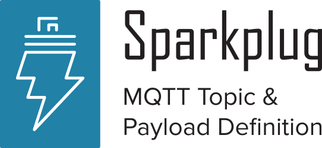

image:extracted-media/media/image2.png[image,width=44,height=25]
_Version 2.2_

Copyright © 2016-2020 Eclipse Foundation, Inc, Cirrus Link Solutions, and others

This program and the accompanying materials are made available under the
terms of the Eclipse Public License v. 2.0 which is available at
https://www.eclipse.org/legal/epl-2.0.
SPDX-License-Identifier: EPL-2.0

_Sparkplug™ and the Sparkplug™ logo are trademarks of the Eclipse Foundation_

[cols=",,,",options="header",]
|===
|*Revision Number* |*Date* |*Author* |*Description*
|1.0 |5/26/16 |Cirrus Link |Initial Release
|2.1 |12/10/16 |Cirrus Link |Payload B Addition
|2.2 |10/11/19 |Cirrus Link |Re-branding for Eclipse foundation added TM to Sparkplug
| | | |
| | | |
|===

== Table of Contents

Table of Figures 5

{empty}1. Introduction 6

1.1. Define an MQTT Topic Namespace 6

1.2. Define MQTT State Management 6

1.3. Define the MQTT Payload 6

{empty}2. Background 7

{empty}3. Infrastructure Components 8

3.1. MQTT Server(s) 8

3.2. MQTT Edge of Network (EoN) Node 8

3.3. Device/Sensor 8

3.4. MQTT Enabled Device(Sparkplug™) 8

3.5. SCADA/IIoT Host 9

3.6. MQTT Application Node 9

3.7. Security 9

3.7.1. Authentication 9

3.7.2. Authorization 9

3.7.3. Encryption 9

{empty}4. Leveraging Standards and Open Source 10

4.1. OASIS MQTT V3.1.1 Specification 10

4.2. Eclipse Foundation IoT Resources 10

4.2.1. Paho 10

4.3. Google Protocol Buffers 10

4.3.1. Kura Google Protocol Buffer Schema 10

4.4. Raspberry Pi Hardware 10

{empty}5. General Message Flow 11

5.1. MQTT Session State Awareness 11

{empty}6. Sparkplug™ MQTT Topic Namespace 12

6.1. Sparkplug™ Topic Namespace Elements 12

6.1.1. namespace Element 12

6.1.2. group_id Element 12

6.1.3. message_type Element 13

6.1.4. edge_node_id Element 13

6.1.5. device_id Element 13

{empty}7. Sparkplug™ MQTT Message Types 14

7.1. MQTT EoN Birth and Death Certificate 14

7.1.1. EoN Death Certificate (NDEATH) 15

7.1.2. EoN Birth Certificate (NBIRTH) 15

7.2. MQTT EoN node Data (NDATA) 15

7.3. MQTT Device Birth and Death Certificate 15

7.3.1. MQTT Device Birth Certificate (DBIRTH) 16

7.3.2. MQTT Device Death Certificate (DDEATH) 16

7.4. MQTT Device Data Messages (DDATA) 16

7.5. SCADA/IIoT Host Birth and Death Certificates 16

7.5.1. SCADA/IIoT Host Death Certificate Payload (STATE) 17

7.5.1. SCADA/IIoT Birth Certificate Payload (STATE) 17

7.6. EoN node Command (NCMD) 17

7.7. Device Command (DCMD) 18

{empty}8. Sparkplug™ MQTT Session Management and Message Flow 19

8.1. Primary Application Session Establishment 20

8.2. EoN node Session Establishment 22

8.3. MQTT Device Session Establishment 24

8.4. General MQTT applications and non-primary Applications. 26

{empty}9. Sparkplug™ MQTT Data and Command Messages 27

9.1. EoN NDATA and NCMD Messages 28

{empty}10. Primary Application STATE in Multiple MQTT Server Topologies 30

{empty}11. Sparkplug™ Persistent versus Non-Persistent Connections 32

{empty}12. Contact Information 33

Appendix 1 Sparkplug™ B Payload Definition 34

== Table of Figures

Figure 1 - MQTT SCADA Infrastructure 8

Figure 2 - Simple MQTT Infrastructure 11

Figure 3 - Host Session Establishment 20

Figure 4 - EoN node MQTT Session Establishment 22

Figure 5 - MQTT Device Session Establishment 24

Figure 6 - EoN node NDATA and NCMD Message Flow 29

Figure 7 – Primary Application STATE flow diagram 30

== Leveraging Standards and Open Source

In addition to leveraging the latest MQTT V3.1.1 standards, the Sparkplug™ specification leverages as much open source development tooling and data encoding as possible.

=== OASIS MQTT V3.1.1 Specification

The Sparkplug™ specification specifies that MQTT Server/Clients in the infrastructure adhere to the MQTT V3.1.1 specification. The specification documentation refers to “*_mqtt-v3.1.1-os.doc_*”:

http://docs.oasis-open.org/mqtt/mqtt/v3.1.1/mqtt-v3.1.1.html

Also referred is an addendum document to the MQTT V3.1.1 specification document that discusses best practices for implementing security on MQTT TCP/IP networks:

http://docs.oasis-open.org/mqtt/mqtt-nist-cybersecurity/v1.0/mqtt-nist-cybersecurity-v1.0.doc

=== Eclipse Foundation IoT Resources

The Eclipse Foundation is an excellent resource for open source software supporting industry standards. Within the Eclipse Foundation is an Internet of Things (IoT) working group providing a wealth of information.

http://iot.eclipse.org/

==== Paho

Paho is an Eclipse Foundation project that offers excellent resources for mature, compliant MQTT Client and MQTT Server implementations and well as additional resources for all things MQTT.

http://www.eclipse.org/paho/

=== Google Protocol Buffers

Protocol buffers are Google's language-neutral, platform-neutral, extensible mechanism for serializing structured data. Google Protocol Buffers are used to encode the Sparkplug™ payload in both versions A and B of the Sparkplug™ payload specification.

https://developers.google.com/protocol-buffers/

==== Kura Google Protocol Buffer Schema

Kura is another Eclipse Foundation project under IoT resources. Kura provides open source resources for the Google Protocol Buffer representation of MQTT payloads as defined in the Sparkplug™ A payload definition:

https://github.com/eclipse/kura/blob/develop/kura/org.eclipse.kura.core.cloud/src/main/protobuf/kurapayload.proto

=== Raspberry Pi Hardware

For the sake of keeping the Sparkplug™ specification as real world as possible, a reference implementation of an EoN node and associated Device is provided for the examples and screen shots in this document. All of this was implemented on Raspberry Pi hardware representing the EoN node with a Pibrella I/O board representing the Device.

== Sparkplug™ MQTT Data and Command Messages

Looking back in this document we’ve described the following components:

* Primary Application
* MQTT Server(s)
* Edge of Network (EoN) nodes
* Devices
* Topic Namespace
* Birth Certificates
* Death Certificates
* STATE Messages
* Primary Application, EoN node, and Device Session Establishment

All of these specifications and definitions get to the primary goal of Sparkplug™, that is to deliver a rich set of real time device metric data extremely efficiently to many data consumers within the Enterprise while still providing a best in class Command/Control SCADA/IIoT system.

The disruptive notion of the emerging IIoT mindset is that intelligent devices should be smart enough to deliver metric information to the infrastructure when it is required. But the fact of the matter is that the existing population of 100’s of millions of the smart devices need to be “asked” if something has changed using poll/response protocols. This is why we’re seeing the emergence of edge devices throughout the industrial sector. For the decade or more that it will take for device manufactures to embed IIoT technology natively, the solution being employed today is to place this capability in small embedded devices closer to the data producers themselves. So within the Sparkplug™ specification these devices called Edge of Network Nodes (EoN) represent this new class of Gateway, Edge Controller, Edge of Network Node, Protocol Gateway, and many more acronyms for the same class of devices. The capabilities of these devices are in an extreme range of low power microcontrollers to multicore Intel and ARM based processors. The operating systems range from full embedded Linux kernels and Windows embedded to small bare metal RTOS’s. Regardless of the category these gateway devices fall into the simplicity of MQTT and the Sparkplug™ specification should be applicable across the board.

This section of the Sparkplug™ specification goes into detail on how metrics are published/subscribed to within an MQTT infrastructure in real time and the resulting metric information that the _Primary Application_ can read/write to.

== Contact Information 

The Eclipse Foundation appreciates any and all feedback on this specification. It is only from the feedback of end users that Sparkplug™ can a viable and vibrant reference implementation for MQTT based SCADA and IIoT solutions.

For any questions regarding this Sparkplug™ specification or for more information, please use the following details:

*Eclipse Foundation*

Website: http://www.eclipse.org[www.eclipse.org]

Phone: +1.613.224.9461

[arabic]
. Sparkplug™ B Payload Definition

Sparkplug™ Specification

Sparkplug™ B Payload Definition

Version v1.0

** +
**

[cols=",,,",options="header",]
|===
|*Revision Number* |*Date* |*Author* |*Description*
|1.0 |1/16/2017 |Cirrus Link |Initial Release
| | | |
| | | |
|===

== Table of Contents

Table of Figures 39

{empty}13. Introduction 40

{empty}14. Sparkplug™ B MQTT Payload Definition 40

14.1. Google Protocol Buffers 41

14.2. Sparkplug™ B Google Protocol Buffer Schema 41

14.3. Payload Metric Naming Convention 44

{empty}15. Sparkplug™ Bv1.0 Payload Components 46

15.1. Payload Component Definitions 46

15.1.1. Payload 46

15.1.2. Metric 46

15.1.3. MetaData 48

15.1.4. PropertySet 48

15.1.5. PropertyValue 49

15.1.6. PropertySetList 49

15.1.7. DataSet 49

15.1.8. DataSet.Row 50

15.1.9. DataSet.DataSetValue 50

15.1.10. Template 50

15.1.11. Template.Parameter 51

15.2. Sparkplug™ Bv1.0 Payload Datatypes 51

15.2.1. Metric Datatypes 51

15.2.2. PropertyValue Datatypes 53

15.2.3. DataSetValue DataTypes 55

15.2.4. Template.Parameter DataTypes 56

{empty}16. Payloads by Message Type 58

16.1. NBIRTH 58

16.2. DBIRTH 59

16.3. NDATA 59

16.4. DDATA 59

16.5. NCMD 60

16.6. DCMD 60

16.7. DDEATH 60

16.8. NDEATH 60

16.9. STATE 60

{empty}17. Payload Representation on Backend Applications 61

17.1. NBIRTH 61

17.2. DBIRTH 62

17.3. NDATA 64

17.4. DDATA 65

17.5. NCMD 66

17.6. DCMD 66

17.7. NDEATH 67

17.8. DDEATH 67

17.9. STATE 68

== Table of Figures

Figure 1 – Payload Metric Folder Structure 45

Figure 2 – Sparkplug™ B Metric Structure 1 62

Figure 3 – Sparkplug™ B Metric Structure 2 64
